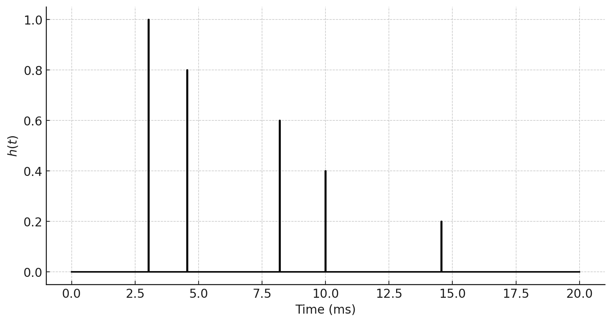

# תגובת להלם

### פונקציית דלתא
בוא נתחיל להשתמש בלינאריות של המערכת!
אמרנו לשאפשר לפרק את המערכת לאותות פשוטים. מה האות הכי פשוט
שאפשר לחשוב עליו? כנראה שאות קבוע. אבל קצ תקשה להרכיב אותות 
מחיבור של אותות קבועים. ננסה משהוא אחר. אות שהוא אפס בכל מקום חוץ מבנקודה אחת.
כן כן, פונקציית דלתא.

חשוב לחזור קצת על תכונות של פונקציית דלתא.
נתחיל מזה שלקרוא לה פונקציה זה קצת עקום. פונקציה אמורה להחזיר ערך $x$ על כל
ערך $t$ שהיא מקבלת. מה $\delta\left(t-\tau\right)$ מחזירה  בנקודה $\tau$?
לא ניכנס לסיבוך המתמטי של "אפיון מרחב האותות" בקורס הזה.
פונקציית דלתא אצלנו תיקרא גם "הלם" או באנגלית "impulse"
תכונות פונקציית הדלתא הן:

$$
\delta\left(t\ne0\right)=0
$$
$$
\intop_{-\infty}^{\infty}\delta\left(t\right)dt=1
$$

כלומר כל מה שאנחנו צריכים לדעת עליה זה שהיא אפס בכל מקום ושהאינטגרל עליה הוא 1
תכונה מאוד חשובה שנשתמש בה הרבה היא העובדה שכשמכפילים פונקציה כלשהי $x\left(t\right)$
בפונקציית דלתא מקבלים את ערך הפונקציה בנקודה כפול פונקציית הדלתא. כלומר:

$$
x\left(t\right)\cdot\delta\left(t-\tau\right)=x\left(\tau\right)\cdot\delta\left(t-\tau\right)
$$

שימו לב שלא ברור מה כאן הוא משתנה של זמן ומה הוא זמן כלשהו. כלומר אפשר לחשוב על ציר הזמן בתור $\tau$
וכל $t$ בתור נקודה עליו. זה לא סתם ואנחנו נעבור בין צורות ההסתכלות האלו הרבה.

ומכאן ניתן לכתוב:

$$
\intop_{-\infty}^{\infty}x\left(\tau\right)\cdot\delta\left(t-\tau\right)d\tau=\intop_{-\infty}^{\infty}x\left(t\right)\cdot\delta\left(t-\tau\right)d\tau=x\left(t\right)\underset{1}{\underbrace{\intop_{-\infty}^{\infty}\cdot\delta\left(t-\tau\right)d\tau}}=x\left(t\right)
$$
$$
\boxed{\underset{\text{תוא}}{\underbrace{x\left(t\right)}}=\intop_{-\infty}^{\infty}\underset{\text{רפסמ}}{\underbrace{x\left(\tau\right)}}\cdot\delta\left(t-\tau\right)d\tau}
$$

כלומא כל אות ניתן לכתוב כצירוף לינארי של פונקציות דלתא מושהות


```{admonition} חשיבה כמו באלגברה לינארית
כאן אנחנו מתחילים "להציץ" ללמה מופיעה אלגברה לינארית. אנחנו הולכים לדבר על זה עוד
 הרבה אבל איך שאפשר לחשוב על הביטוי שכרגע רשמנו הוא
 
$$\overrightarrow{x}_{i}=\sum_{j}\overrightarrow{x}_{j}\cdot\delta_{ij}$$
  
או אם לכתוב את אותה נוסחה רק לכל $i$
 
$$ \underset{\text{רוטקו}}{\underbrace{\overrightarrow{x}}}=\sum_{j}\underset{\text{רפסמ}}{\underbrace{\overrightarrow{x}_{j}}}\cdot\underset{\text{רוטקו}}{\underbrace{\overrightarrow{e_{j}}}} $$
```

### פירוק של אות במערכת לינארית
נשתמש בתכונה החשובה שלנו עבור פונקציית דלתא וכל אות כדי לכתוב
כיצד מערכת לינארית כלשהי פועלת עליו

$$
T:\left\{ x\left(t\right)\right\} =T:\left\{ \intop_{-\infty}^{\infty}\underset{\text{רפסמ}}{\underbrace{x\left(\tau\right)}}\cdot\delta\left(t-\tau\right)d\tau\right\} =\intop_{-\infty}^{\infty}\underset{\text{םדקמ}}{\underbrace{x\left(\tau\right)}}\cdot T:\left\{ \delta\left(t-\tau\right)\right\} d\tau
$$

ואם נסמן

$$
h\left(t,\tau\right)\equiv T:\left\{ \delta\left(t-\tau\right)\right\} 
$$

נקבל לבסוף:

$$
\boxed{T:\left\{ x\left(t\right)\right\} =\intop_{-\infty}^{\infty}\underset{\text{םדקמ}}{\underbrace{x\left(\tau\right)}}\cdot\underset{\text{םלהל}-\text{הבוגת}}{\underbrace{h\left(t,\tau\right)}}d\tau}
$$

```{admonition} פונקציית התגובה להלם כמטריצה

$$ h\left(\underset{\text{הבוגתה}-\text{תדידמ}-\text{ןמז}}{\underbrace{t}},\underset{\text{םלהה}-\text{ןמז}}{\underbrace{\tau}}\right)$$
ניתן לחשוב על זה כמו שני אינדקסים של מטריצה ואז הנוסחה שלמעלה היא ממש הגיונית 

$$\overrightarrow{y}_{t}=\left[T:\left\{ \overrightarrow{x}\right\} \right]_{t}=\sum_{\tau}\overrightarrow{x}_{\tau}\cdot h_{t,\tau}$$

כלומר שניתן לחשוב על זה "כאילו" כל מערכת לינארית מיוצגת על ידיד מטריצה $h$ ועכשיו למדנו גם איך לחשב אותה
```

### תכונות של פונקציית התגובה להלם
1. ממשית (האותות פיזיקלים)
2. סיבתית - $\forall t<\tau:h\left(t,\tau\right)=0$
3. יחידות

### דוגמאות

#### התקדמות גלים בחלל חופשי עם החזרות
נניח שיש לנו רמקול בנקודה מסויימת בחדר ובמקום אחר בחדר יש מיקרופון.
אם הרמקול ישמיע צליל קצר וחזק (דלתא) המיקרופון ישמע את הצליל בדיליי אבל הוא גם ישמע את כל ההחזרות מהקירות של אותו צליל
כלומר שפונקציית התמסורת תהיה מהצורה הבאה:

$$
h\left(t,\tau\right)=\sum_{i}\alpha_{i}\delta\left(t-\left(\tau+\frac{d_{i}}{c}\right)\right)
$$

כלומר יגיעו למירופון גם דלתאות אבל בזמנים שונים לפי המרחקים השונים $d_i$ והניחותים השונים $\alpha_i$ כמו בתמונה הבאה:


פונקציית התגובה להלם תיראה ככה:

נשים לב שאם נחשב את פלט המערכת הזו נקבל:

$$T:\left\{ x\left(t\right)\right\} =\intop_{-\infty}^{\infty}x\left(\tau\right)h\left(t,\tau\right)d\tau=\intop_{-\infty}^{\infty}x\left(\tau\right)\sum_{i}\alpha_{i}\delta\left(t-\left(\tau+\frac{d_{i}}{c}\right)\right)d\tau$$
$$=\sum_{i}\alpha_{i}\intop_{-\infty}^{\infty}x\left(\tau\right)\delta\left(t-\tau-\frac{d_{i}}{c}\right)d\tau=\sum_{i}\alpha_{i}x\left(t-\frac{d_{i}}{c}\right)$$

כלומר אות משוכפל עם דיליי וניחות. כלומר קיבלנו פשוט הד!

#### אוסילטור הרמוני מרוסן
אנחנו יודעים כבר שמשוואת אוסילטור הרמוני מרוסן היא:

$$F\left(t\right)=m\ddot{x}+\gamma\dot{x}+kx$$

כלומר שכדי לחשב את התדובה להלם כל מה שאנחנו צריכים לעשות היא "להכניס דלתא למערכת" כלומר לםתור את המשוואה:

$$\delta\left(t-\tau\right)=m\ddot{h}+\gamma\dot{h}+kh$$

שימו לב שעכשיו נסמן את הפתרון ב $h$ ולא ב$x$ משום שזה הפלט של המערכת עבור הלם. 
אנחנו לא נעשה את זה כאן ורק נומר שהפתרון הוא:

$$h\left(t,\tau\right)=\theta\left(t-\tau\right)\frac{1}{m\omega_{D}}e^{-\frac{\gamma}{2m}\left(t-\tau\right)}\sin\left(\omega_{D}\left(t-\tau\right)\right)$$
$$\omega_{D}=\sqrt{\frac{k}{m}-\left(\frac{\gamma}{2m}\right)^{2}}$$

שזה מה שאנחנו מצפים. נותנים מכה לאוסילטור בזמן $\tau$ והוא מתחיל להתנדנד ולדאוך. לפני זמן המכה הוא כמובן לא זז ולכן פונקציית המדרגה. את תכונה זו של פונקציית התגובה להלם אנחנו פשוט מניחים פיזיקאלית וקוראים לה קוזאליות. כלומר:
לפני ההלם בזמן $t-\tau$ פונקציית התגובה להלם צריכה להיות $0$. אין תגובה "אחורה בזמן"
מתמטית נכתוב: 

$$\forall t<\tau:h\left(t,\tau\right)=0$$

נשים לב שבכל מקום בפונקציית התגובה להלם מופיע $t-\tau$. כלומר נוכל לרשום: 

$$ h\left(t,\tau\right)=h\left(t-\tau\right)$$
ישנן כל כך הרבה מערכות שהדבר הזה נכון להן שיש להן שם מיוחד. LTI!!!

במערכות אלו פונקציית התגובה להלם תלוייה רק בכמות הזמן שחלף מאז שהיה ההלם ולא בזמן של ההלם עצמו.

### מערכות LTI
עבור מערכות אלו נרשום:

$$T:\left\{ x\left(t\right)\right\} \underset{Linear}{\underbrace{=}}\intop_{-\infty}^{\infty}x\left(\tau\right)h\left(t,\tau\right)d\tau\underset{Time-Intariant}{\underbrace{=}}\intop_{-\infty}^{\infty}x\left(\tau\right)h\left(t-\tau\right)d\tau\equiv x\left(t\right)\ast h\left(t\right)$$

המעבר האחרון הוא סימון. לאינטגרל $\intop_{-\infty}^{\infty}x\left(\tau\right)h\left(t-\tau\right)$ יש שם מיוחד. הוא נקרא קונבולוציה ונסמן אותו ב-$x\left(t\right)\ast h\left(t\right)$
נסכם את התוצאה שלנו

```{admonition} מערכות LTI
:class: tip

$$T:\left\{ x\left(t\right)\right\} =x\left(t\right)\ast h\left(t\right)$$
$$x\left(t\right)\ast h\left(t\right)\equiv\intop_{-\infty}^{\infty}x\left(\tau\right)h\left(t-\tau\right)$$

```


