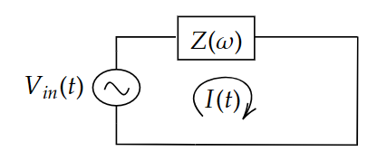
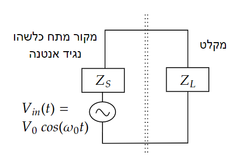

# הספק על רכיב מרוכב

### עומס מרוכב 


נרצה לדעת בהינתן רכיב כללי עם עכבה כלשהי $Z\left(\omega\right)=R\left(\omega\right)+i\chi\left(\omega\right)=\left|Z\left(\omega\right)\right|e^{i\phi\left(\omega\right)}$
מה ההספק "שנופל" עליו. כלומר בכמה אנרגיה הוא משתמש.

$$P\left(t\right)=I\left(t\right)\cdot V\left(t\right)$$

נשים לב שאנחנו צריכים להיזהר כאן. יש לנו משוואה עם כפל ולכן לא נוכל באמת להחליף את הכל להיות במרחב התדר. אנחנו נקבל בצד שמאל קונבולוציה בין הזרם למתח.
על מנת להיות מסוגלים לומר משהו חכם נתחיל ממקרה פשוט:

$$V\left(t\right)=V_{0}\cos\left(\omega_{0}t+\phi\right)$$
$$\frac{1}{Z\left(\omega\right)}=\frac{1}{\left|Z\left(\omega\right)\right|}e^{-\phi\left(\omega\right)}$$
$$\Downarrow$$
$$I\left(t\right)=\frac{1}{\left|Z\left(\omega_{0}\right)\right|}V_{0}\cos\left(\omega_{0}t-\phi\left(\omega_{0}\right)\right)$$

נשתמש במשוואה להספק ונקבל:

$$\boxed{P\left(t\right)=\frac{V_{0}^{2}}{2\left|Z\left(\omega_{0}\right)\right|}\left[\cos\left(2\omega_{0}t-\phi\left(\omega_{0}\right)\right)+\cos\left(\phi\left(\omega_{0}\right)\right)\right]}$$

או עם שימוש בזהויות טריגונומטריות:

$$\boxed{P\left(t\right)=\frac{V_{0}^{2}}{2\left|Z\left(\omega_{0}\right)\right|}\left[\cos\left(2\omega_{0}t-\phi\left(\omega_{0}\right)\right)+\cos\left(\phi\left(\omega_{0}\right)\right)\right]}$$

נשים לב ששום דבר לא מונע מההספק להיות שלילי! מתי זה קורה? האם יכול להיות רכיב שבזמן מסויים "מחזיר" אנרגיה למעגל במקום לעלות אנרגיה?
כמובן שכן, אנחנו מכירים פריקה וטעינה גם של קבל וגם של סליל

נשאל שאלה יותר קשה. האם ההספק יכול להיות שלילי בבמוצע? נחשב

$$P_{avg}\equiv\left\langle P\left(t\right)\right\rangle \equiv\overline{P\left(t\right)}=\lim_{T\rightarrow\infty}\frac{1}{T}\intop_{-\frac{T}{2}}^{\frac{T}{2}}P\left(t\right)dt$$

עבור אות מחזורי נקבל

$$\left\langle P\left(t\right)\right\rangle =\frac{1}{T}\intop_{0}^{T}P\left(t\right)dt=\frac{V_{0}^{2}}{2\left|Z\left(\omega_{0}\right)\right|}\frac{\omega_{0}}{2\pi}\intop_{0}^{\frac{2\pi}{\omega_{0}}}\underset{0}{\underbrace{\cos\left(2\omega_{0}t-\phi\left(\omega_{0}\right)\right)}}+\cos\left(\phi\left(\omega_{0}\right)\right)dt$$
$$\left\langle P\left(t\right)\right\rangle =\frac{V_{0}^{2}}{2\left|Z\left(\omega_{0}\right)\right|}\cos\left(\phi\left(\omega_{0}\right)\right)$$

כדי לדעת כמה הספק רכיב חשמלי צורך חשוב לדעת מה הפאזה שלו. מתח קיר הוא בתדר קבוע של 50Hz ולכן להרבה רכיבים בבית תוכלו למצוא
במדבקה או במפרט שלהם מה ה-$\phi=\phi\left(2\pi\cdot50\right)$

קיבלנו שיש רכיבים שלא צורכים הספק. מי הרכיבים האלו? 

$$\cos\left(\phi\left(\omega_{0}\right)\right)=0\Rightarrow\phi\left(\omega_{0}\right)=\frac{\pi}{2}+k\pi\Rightarrow\boxed{\Re\left[Z\left(\omega_{0}\right)\right]=0}$$

מתי יש הספק שלילי:

$$\cos\left(\phi\left(\omega_{0}\right)\right)<0\Rightarrow\Re\left[Z\left(\omega_{0}\right)\right]<0$$

כלומר אנחנו צריכים רכיב עם חלק ממשי של העכבה שהוא שלילי. האם אתם מכירים כזה?
[מוזמנים להסתכל לדוגמא על הרכיב הזה](https://en.wikipedia.org/wiki/Negative_impedance_converter)

```{admonition} מסקנה חשובה:
:class: tip
בעומס עם עכבה מרוכבת ההספק מתבזבז רק בחלק הממשי של האימפדנס
```

דוגמאות:
* נגד - $Z=R\Rightarrow\phi=0\Rightarrow\cos\left(\phi\right)=1$
* עומס מדומה (סליל או קבל) - $Z=i\chi\left(\omega\right)\Rightarrow\phi\in\left\{ \frac{\pi}{2},\frac{3\pi}{2}\right\} \Rightarrow\cos\left(\phi\right)=0$

נוכל לסכם את זה במשפט:
```{admonition} מסקנה חשובה:
:class: tip
בעומס עם עכבה מרוכבת $\cos\left(\phi\right)$ מספר לנו כמה מההספק שנכנס לרכיב בזמן מחזור מנוצל (מתבזבז) ברכיב
```

### תיאום עכבות מקרה נאיבי

נניח שיש לנו עומס עם חלק השראתי מאוד גדול:

$$Z\left(\omega\right)=i\omega L+R$$
$$L\gg R\Rightarrow\left|\cos\left(\phi\right)\right|\ll1$$

(נשים לב שזה תלוי תדר אבל נניח שאנחנו עובדים בתדר שבו זה באמת נכון)

האם יש דרך כלשהי (ללא בזבוז של הספק נוסף) לגרום לכך ש-$\cos\left(\phi\right)=1$ כלומר שהרכיב שלנו יצרוך את ההספק המקסימלי שהוא יכול?

כמובן שכן! זה קל. פשוט נוסיף קבל למערכת ונקבל עכבה:

$$Z\left(\omega\right)=i\left(\omega L-\frac{1}{\omega C}\right)+R$$

נבחר קבל כך ש-$\omega_{0}=\frac{1}{\sqrt{LC}}$נניח ברשת הביתית $\omega_{0}=2\pi\cdot50$. נקבל כי המשרן והקבל מבטלים זה את זה.

```{admonition} מסקנה:
:class: tip
בתדר רזוננס $\cos\left(\phi\right)=1$ ולכן האימפדנס הכולל ממשי 
```

```{admonition} רמז להמשך הקורס
:class: warning
מה קורה כאשר יש יותר מתדר אחד? מה קורה להספק הרגעי ומה קורה להספק הממוצע?
```

### תיאום עכבות מקלט 
ניקח עכשיו מקרה קצת יותר מציאותי. נניח שיש לנו מקור מתח ומקלט שאנחנו רוצים לחבר אליו



מה צריך להיות העכבה של המקלט כדי שיפול עליו הספק ממוצע מקסימאלי?

השאלה הזו היא קריטית עבור כל חיישן או בכלל רכיב שאתה מחבר למקור מתח משתנה.

נסמן $Z_{L}=Z_{L}\left(\omega_{0}\right),Z_{S}=Z_{S}\left(\omega_{0}\right)$ ונוכל לכתוב:

פעמים רבות אנחנו מעוניינים לעבוד עם מרוכבים. אבל כמו שראינו קודם זה לא אפשרי בגלל הכפל בנוסחה של ההספק. אבל מה אם מעניין אותנו רק ההספק הממוצע?

ראינו כבר שאם המתח על עומס מסויים $Z$ הוא $V\left(t\right)=V_{0}\cos\left(\omega_{0}t\right)$ נקבל כי 

$$I\left(t\right)=\frac{V_{0}}{\left|Z\right|}\cos\left(\omega_{0}t+\phi_{Z}\right)$$
$$\left\langle P\right\rangle =\frac{V_{0}^{2}}{2\left|Z\right|}\cos\left(\phi_{Z}\right)$$

במקום לעבוד קשה ולעשות את האינטגרלים של הממוצע כל הזמן נגדיר:

$$V\left(t\right)=V_{0}e^{i\omega_{0}t}$$
$$I\left(t\right)=\frac{V_{0}}{\left|Z\right|}e^{i\left(\omega_{0}t+\phi_{Z}\right)}$$

ולכן כדי לחשב את ההספק הממוצע כל מה שנצטרך לחשב הוא:

$$\left\langle P\right\rangle =\frac{1}{2}\Re\left[V\left(t\right)I^{\ast}\left(t\right)\right]=\frac{1}{2}\Re\left[\frac{V_{0}^{2}}{\left|Z\right|}e^{i\phi_{Z}}\right]=\frac{V_{0}^{2}}{2\left|Z\right|}\cos\left(\phi_{Z}\right)$$

עכשיו אנחנו מוכנים לעשות חישובים במעגל שלנו

$$I\left(t\right)=\frac{V_{0}e^{i\omega_{0}t}}{Z_{L}+Z_{S}}$$
$$V_{L}\left(t\right)=Z_{L}I\left(t\right)=\frac{Z_{L}}{Z_{L}+Z_{S}}V_{0}e^{i\omega_{0}t}$$

עד כאן כל מה שעשינו הם חישובים ללא כפל ולכן נוכל לקחת את החלק הממשי ולקבל את הזרם בזמן ואת המתח בזמן על הרכיב שלנו.

אבל במקום לעשות את זה להכפיל ואז למצע בזמן יש לנו קיצור דרך:

$$\left\langle P_{L}\right\rangle =\frac{1}{2}\Re\left[V_{L}\left(t\right)I^{\ast}\left(t\right)\right]=\frac{1}{2}\Re\left[\frac{Z_{L}}{Z_{L}+Z_{S}}V_{0}e^{i\omega_{0}t}\left(\frac{V_{0}e^{i\omega_{0}t}}{Z_{L}+Z_{S}}\right)^{\ast}\right]$$
$$=\frac{1}{2}\Re\left[\frac{Z_{L}}{\left(Z_{L}+Z_{S}\right)\left(Z_{L}+Z_{S}\right)^{\ast}}\left|V_{0}\right|^{2}e^{i\omega_{0}t}e^{-i\omega_{0}t}\right]$$
$$=\frac{1}{2}\Re\left[\frac{Z_{L}}{\left|Z_{L}+Z_{S}\right|^{2}}\left|V_{0}\right|^{2}\right]$$

לבסוף קיבלנו כי:

$$\left\langle P_{L}\right\rangle =\frac{\left|V_{0}\right|^{2}}{2}\frac{\Re\left[Z_{L}\right]}{\left|Z_{L}+Z_{S}\right|^{2}}$$

עכשיו אנחנו שואלים איזה $Z_{L}$ יתן את המקסימום. נשים לב שהחלק המדומה משפיע רק על המכנה ולכן קל לראות שצריך לדרוש (מוזמנים לגזור ולראות בעצמכם)

$$\Im\left[Z_{L}\right]=-\Im\left[Z_{S}\right]$$

ועכשיו מקבלים:

$$\left\langle P_{L}\right\rangle =\frac{\left|V_{0}\right|^{2}}{2}\frac{\Re\left[Z_{L}\right]}{\left(\Re\left[Z_{L}\right]+\Re\left[Z_{S}\right]\right)^{2}}$$

והמקסימום מתקבל עבור:

$$\Re\left[Z_{L}\right]=\Re\left[Z_{S}\right]$$

נקבל הספק מקסימלי של:

$$P_{L}\left(Z_{L}=Z_{S}^{\ast}\right)=\frac{\left|V_{0}\right|^{2}}{2}\frac{R_{S}}{\left(R_{S}+R_{S}\right)^{2}}=\frac{\left|V_{0}\right|^{2}}{8R_{S}}$$

```{admonition} מסקנה חשובה:
:class: tip
תיאום עכבות יתבצע כאשר $Z_{L}=Z_{S}^{\ast}$ והוא מבטיח ניצול הספק **ממוצע** מקסימלי

עבור מקור עם עכבה ממשית $R_{S}$ נקבל תיאום עבור $R_{L}=R_{S}$ 
```

חשוב לציין שלמערכת יש אפשרות לתאם "בכל תדר" אבל רק בנפרד אלא אם העכבה שווה בכמה תדרים שונים.

מומזנים לנסות לתאם עכבות ולראות מה ההספק שנופל על העומס L

<iframe src="https://www.geogebra.org/material/iframe/id/qpb4yvjq" width="100%" style="border: 1px solid #ccc; aspect-ratio: 2 / 1" frameborder=0></iframe>
<a href="https://www.geogebra.org/material/iframe/id/qpb4yvjq" target="_blank">לפתיחה בחלון נפרד</a>