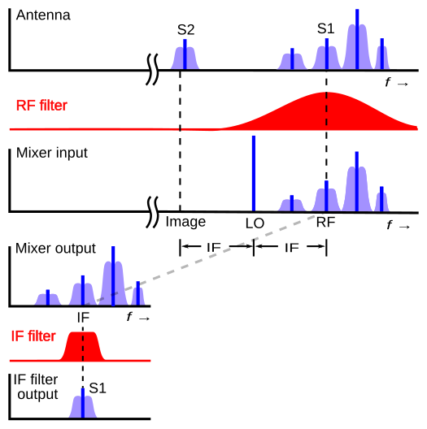

# אפנון AM

### יצוג בזמן

אנחנו צריכים שיטה לקחת אות $f\left(t\right)$ ולאפנן אותו. הנוסחה תהיה:

$$g_{AM}\left(t\right)=\underset{A\left(t\right)}{\underbrace{\left[1+mf\left(t\right)\right]}}\cos\left(\omega{}_{0}t\right)$$

למספר $m$ נקרע עומק המודולציה או באנגלית modulation index

להמחשה:


ההנחות שלנו הן:
* האות "משתנה לאט" ביחס ל-$\frac{2\pi}{\omega_{0}}$ ניתן לחשוב על זה ככה שהתדר המקסימלי של המידע קטן משמעותית מהתדר הנושא. $\omega_{0}\gg\omega_{max}$
  * האם זה נכון לגלי רדיו שתדר השידור המקסימלי שלהם הוא: $\omega_{max}=2\pi\cdot20KHz\approx120\cdot10^{3}$
* האמפליטודה צריכה להיות תמיד גדולה מאפס - $1+mf\left(t\right)>0$

מה קורה אם ההנחה השנייה לא מתקיימת?


חשוב לזכור שאנחנו קולטים רק את האות האדום

נקבל שאנחנו צריכים בכל חילוף סימן "להחליף" את הסימן של המעטפת שאנחנו עוקבים אחריה

מטרת המקלט שלנו היא לשחזר את האות הכחול (בגרף העליון) מתוך האות האדום

### יצוג בתדר
ננסה להבין איך נראה האות בתדר אחרי האפנון

$$\tilde{G}\left(\omega\right)=\mathcal{F}\left[\left(1+mf\left(t\right)\right)\cos\left(\omega{}_{0}t\right)\right]$$
$$=\mathcal{F}\left[1+mf\left(t\right)\right]\ast\mathcal{F}\left[\cos\left(\omega{}_{0}t\right)\right]$$
$$=\left(\delta\left(\omega\right)+m\tilde{F}\left(\omega\right)\right)\ast\frac{1}{2}\left(\delta\left(\omega-\omega_{0}\right)+\delta\left(\omega+\omega_{0}\right)\right)$$
$$\Downarrow$$
$$\boxed{\tilde{G}\left(\omega\right)=\frac{1}{2}\left[\left(\delta\left(\omega-\omega_{0}\right)+m\tilde{F}\left(\omega-\omega_{0}\right)\right)+\left(\delta\left(\omega+\omega_{0}\right)+m\tilde{F}\left(\omega+\omega_{0}\right)\right)\right]}$$

קיבלנו שכפול (שזה לא מפתיע כי אנחנו תמיד משדרים משהו ממשי) של האות סביב תדר $\omega_{0}$ וסביב $-\omega_{0}$ כאשר בנוסף לזה קיבלנו דלתא בכל אחד מהתדרים האלו


חשוב לשים לב לסימטריה הכפולה. בגלל שאנחנו משדרים אות ממשי שני הצדדים הם הצמוד אחד של השני
אבל גם סביב תדר הגל הנושא יש לנו סימטריה כי כבר במקור המידע שלנו היה ממשי!

מסקנות:
* רוחב הסרט (רוחב הפס) של שידור AM הוא $\Delta\omega=2\omega_{max}$
* עומק המודולציה משפיע על **יעילות השידור** כלומר כמה מהסספק הוא המידע ואיזה הוא רק הגל הנושא
* נשים לב שאידאלית אנחנו רוצים לשדר "בלי הגל הנושא" כלומר בלי ה-$+1$ ובנוסף רק אונה אחת מתוך השתיים

### משדר AM אנלוגי
נרצה לממש את האפנון ברכיבים חשמליים

נראה שאת רוב הרכיבים אנחנו לא באמת מכירים אבל יש שני רכיבים שהם מורכבים במיוחד. האוסילטור (LO) והמיקסר.
ניתן לחשוב על האוסילטור בתור פילטר מאוד מאוד מוצלח. הוא מקבל קלט בהמון תדרים (נגיד הלם - זץ חשמלי) והוא מפלטר את כל התדרים חוץ מתדר מאוד מאוד ספציפי.
להשיג מבנה כזה זה מורכב ובהמשך נראה שזה אחד הרכיבים הקריטיים במערכות קליטה ושידור
אבל איך ממשים מיקסר? הוא מייצר תדרים חדשים ולכן הפעולה שלו בהגדרה היא לא לינארית!

#### מימוש מיקסר
בפועל נרצה לממש מכפלה של אותות על ידי רכיב לא לינארי. ניקח דיודה כדוגמא.
להבין איך דיודה בדיוק פועלת זה סיפור ממש ארוך אבל אנחנו לא באמת צריכים כי אנחנו עובדים במודל הרכיבים המקובצים ולכן מספיק שאני אומר לכם את הקשר בין המתח לזרם:

$$I\left(V\right)=I_{0}\left(e^{bV}-1\right)$$

נניח שהמתח לא משתנה יותר מידי (יהיה לנו יותר קל לחשב) וניקח קירוב טיילור סביב מתח העבודה $V_{0}$

$$I\left(V\right)\approx I\left(V_{0}\right)+\left(V-V_{0}\right)\left.\frac{dI}{dV}\right|_{V_{0}}+\frac{1}{2}\left(V-V_{0}\right)^{2}\left.\frac{d^{2}I}{dV^{2}}\right|_{V_{0}}$$
$$I\left(V\right)\approx I_{0}+\alpha V+\beta V^{2}$$

עכשיו נראה מה קורה לזרם בדיודה כאשר המתח עליה הוא $V=\cos\left(\omega_{0}t\right)+f\left(t\right)$

$$I=I_{0}+\alpha\left[\cos\left(\omega_{0}t\right)+f\left(t\right)\right]+\beta\left[\cos\left(\omega_{0}t\right)+f\left(t\right)\right]^{2}$$
$$=I_{0}+\alpha\cos\left(\omega_{0}t\right)+\alpha f\left(t\right)+\beta\left[\cos^{2}\left(\omega_{0}t\right)+f^{2}\left(t\right)+2f\left(t\right)\cos\left(\omega_{0}t\right)\right]$$

קיבלנו גם את האיבר שאנחנו רוצים אבל עוד המון איברים אחרים. נסתכל בתדר כדי להבין אם יש לנו יכולת לסנן חלק מהם

$$\tilde{I}\left(\omega\right)=I_{0}\delta\left(\omega\right)+\frac{\alpha}{2}\left[\delta\left(\omega-\omega_{0}\right)+\delta\left(\omega+\omega_{0}\right)\right]+\alpha\tilde{F}\left(\omega\right)+$$
$$+\beta\left[\frac{1}{2}\delta\left(\omega\right)+\frac{1}{4}\left(\delta\left(\omega-2\omega_{0}\right)+\delta\left(\omega+2\omega_{0}\right)\right)+\tilde{F}\left(\omega\right)\ast\tilde{F}\left(\omega\right)+\tilde{F}\left(\omega-\omega_{0}\right)+\tilde{F}\left(\omega+\omega_{0}\right)\right]$$

ואכן נראה שאנחנו יכולים (במידה ו-$\omega_{0}\gg\omega_{max}$) להעביר את כל זה ב-BPF סביב התדר $\omega_{0}$ ולקבל:

$$BPF_{\omega_{0}}\left[I\right]=\left(2\beta f\left(t\right)+\alpha\right)\cos\left(\omega_{0}t\right)$$

ואכן קיבלנו מכפלה!

נשים לב כי:
* אם יש לנו רכיב לא לינארי ריבועי $V_{out}\propto V_{in}^{2}$ נוכל להשתמש ברכיב הזה על מנת לממש מכפלה
* אנחנו יכולים לבחור את הרכיב הלא לינארי
* אנחנו יכלים לבחור את נקודת העבודה $V_{0}$ על מנת להשפיע על הקבועים $I_{0},\alpha,\beta$

בפועל המעגל נראה בערך ככה:


## מימוש מקלט AM
נתון לנו הגל הנושא בקליטה (נניח במוצא האנטנה):

$$g_{AM}\left(t\right)=\left[1+mf\left(t\right)\right]\cos\left(\omega{}_{0}t\right)$$

הבעיה: ואנחנו רוצים לחלץ את האות $f\left(t\right)$

שיטות קליטה מתחלקות לשני סוגים:
* שיטות קוהרנטיות - כלומר שרגישות לפאזה של הגל הנושא
  * בשיטות כאלה נוכל לדעת מתי המעטפת היא "שלילית" כי אנחנו עוקבים אחרי הפאזה
  * נראה עוד יתרון משמעותי של שיטה זו בהמשך (רמז $\Delta\omega=2\omega_{max}$)
* שיטות לא קוהרנטיות
  * לא רגישות לפאזה של הגל הנושא וכל מה שאנחנו נדרשים לדעת הוא התדר של הגל הנושא
  * שיטות לא קוהרנטיות לא יכולות להבדיל בין $\cos\left(\omega_{0}t\right),\cos\left(\omega_{0}t+\frac{\pi}{2}\right)=\sin\left(\omega_{0}t\right),\cos\left(\omega_{0}t+\pi\right)=-\cos\left(\omega_{0}t\right)$ ולכן לא יכולות להתמודד עם עומק מודולציה גדול מידי

### מימוש מקלט לא קוהרנטי פשוט
נרצה משהו שעוקב אחרי השיאים של האות שאנחנו מקבלים. כלומר שכל פעם שאנחנו עולים במתח אנחנו רוצים לעקוב אחרי האות שמתקבל וכל פעם שהגל הנושא יורד במהירות (כי הוא מתנדנד מהר) אנחנו רוצים לדאוך לאט ולתפוס אותו בשיא הבא.

נעשה את זה עם מעגל (לא לינארי כמובן) ונשתמש בדיודה ומעגל RC


נניח דיודה אידאלית חסרת התנגדות
ונסתכל על שני מצבים:
* $V_{D}>0$ כלומר יש מתח חיובי על הדיודה. במצב הזה נקבל כי המקור מחובר ישירות למוצא וחייב לקיים $V_{out}=V_{C}=V_{in}$
* $V_{D}<0$ הדיודה הופכת לנתק והמוצא בכלל לא מחובר למקור אלא למעגל RC שנפרק
  * מתי המתח על הדיודה יחזור להיות חיובי? כשנגיע לנקודה בה $V_{C}=V_{out}<V_{in}$

איך התוצאה תיראה?

[קרדיט](https://www.winlab.rutgers.edu/~crose/322_html/envelope_detector.html)

אנחנו רואים שהדיודה לא נותנת ל-$V_{out}$ להיות קטן מ-$V_{in}$
נשים לב שכמו בתמונה אם גם המעטפת משתנה מהר אנחנו צריכים מעגל RC שדואך מהר יותר. אבל יש בזה סכנה. שנדאך גם בין שיאים של הפונקציה. כלומר ה-ripples בתמונה יגדלו

נשאלת השאלה איך לבחור את $\tau=RC$? יש לנו שני אילוצים:
* אנחנו רוצים לדאוך לאט יותר מזמן המחזור של האוסילטור $\frac{2\pi}{\omega_{0}}\ll RC$
* מעגל ה-RC צריך להיפרק מהר יותר מהקצב הכי מהיר שבו משתנה מעטפת $RC\ll\frac{2\pi}{\omega_{max}}$

לסיכום נבחר:

$$\boxed{\frac{2\pi}{\omega_{0}}\ll RC\ll\frac{2\pi}{\omega_{max}}}$$

אנחנו רואים שחבוייה כאן גם ההנחה שלנו כי $\omega_{max}\ll\omega_{0}$ הנחה זו נכונה ברוחב מערכות התקשורת (כאשר משתמשים בגלים אלקטרומגנטים)

### מקלט הטרודיין
במקלט הפשוט שראינו עם גילוי המעטפת אפשר לברור בין תחנות על ידי סינון של האות מראש עם BPF. 

החיסרון הוא כמובן שאנחנו צריכים לדעת לממש BPF איכותי שגם משתנה ומתאים לכלל התחנות

**הפתרון:** במקום להזיז את הפילטר אל תדר התחנה נזיז את תדר התחנה אל הפילטר. מקלט כזה נקרא מקלט הטרודיין

השלבים בקליטה הם:
* סינון ראשוני ורחב
* הזזה של התדר לתדר ביניים שיקרא IF כך שהתחנה שאנחנו רוצים לקלוט תהיה בדיוק בתדר IF
* נעביר את האות ב-BPF שממורכז סביב IF (נשים לב שזה אותו פילטר לא משנה איזה תחנה אנחנו קולטים)
* נבצע גילוי מעטפת כמו קודם


איך נזיז בתדר? נרצה להכפיל ב-$e^{i\omega_{LO}t}$ אבל אנחנו יכולים להכפיל רק במשהו ממשי ולכן נכפיל ב-$\cos\left(\omega_{LO}t\right)$

הסרטוט של המקלט בשלבים הראה ככה:


מה נקבל אחרי המיקסר?

$$A\left(t\right)\cos\left(\omega_{0}t\right)\cos\left(\omega_{LO}t\right)=\frac{A\left(t\right)}{2}\left[\underset{Low-frequency}{\underbrace{\cos\left(\left(\omega_{0}-\omega_{LO}\right)t\right)}}+\underset{high-frequency}{\underbrace{\cos\left(\left(\omega_{0}+\omega_{LO}\right)t\right)}}\right]$$

את זה כמובן נוכל לסנון עם ה-BPF שלנו ולקבל אות שאנחנו יכולים להכניס לגילוי מעטפת

יש לנו המון תדרים שמשתתפים בקליטה. נעשה סדר:
* $\omega_{0}$ תדר הגל הנושא
* $\omega_{IF}$ תדר הביניים אליו אנחנו מורידים את התחנות שאנחנו רוצים לקלוט
* $\omega_{LO}$  תדר האוסילטור אותו אנחנו מכוונים כך ש-$\omega_{LO}=\omega_{0}-\omega_{IF}$

```{admonition} הורדת תדר:
:class: tip
העיקרון החשוב במקלט הוא שאם אנחנו רוצים להזיז תדר נוכל להכפיל אות סביב תדר $\omega_{0}$ ב-$\cos\left(\omega_{LO}t\right)$ ולקבל את השידור סביב $\omega_{0}-\omega_{LO}$ וסביב $\omega_{0}+\omega_{LO}$  
```

### מקלט קוהרנטי
עד עכשיו עסקנו במקלטים לא קוהרנטים שלא רגישים לפאזה של הגל הנושא:

$$A\left(t\right)\cos\left(\omega_{0}t+\underset{\text{הזאפ}}{\underbrace{\phi_{0}}}\right)$$

למה בכלל שלהיות תלוי בפאזה תהיה בעיה? נדמיין שאנחנו זזים לאט ביחס למשדר. נקבל אפקט דופלר ובקירוב נוכל לרשום:

$$r\left(t\right)\approx A\left(t\right)\cos\left(\left(\omega_{0}+\omega_{d}\right)t+\phi_{0}\right)=A\left(t\right)\cos\left(\omega_{0}t+\underset{\omega_{d}t+\phi_{0}}{\underbrace{\phi\left(t\right)}}\right)$$

כלומר השינוי אולי זניח ביחס לתדר המרכזי ולא מזיז אותו הרבה אבל אנחנו מתחילים לקבל צבירה של פאזה "במהירות" קבועה. אם נהיה רגישים לפאזה זה יכולה להיות בעיה.

אבל כבר הזכרנו יתרון קטן של מקלט קוהרנטי. אם אנחנו "ריגישים" לפאזה אנחנו יכולים להבין מתי המעטפת שלנו הופכת לשלילית.

ניקח השראה ממקלט הטרודיין אבל הפעם נוריד נבחר תדר ביניים שהוא תדר ה-0

נסיון ראשון לבנות סכמה יראה ככה:


מה נקבל לפני ה-LPF?

$$A\left(t\right)\cos\left(\omega_{0}t+\phi_{0}\right)\cos\left(\omega_{0}t\right)=\frac{A\left(t\right)}{2}\left[\cos\left(\phi_{0}\right)+\cos\left(2\omega_{0}t+\phi_{0}\right)\right]$$

איך נתכנן את ה-LPF. כביכול הוא צריך להיות ברוחב של $2\omega_{max}$ אבל אז שמים לב שאנחנו כבר סביב תדר 0 כלמור שהרוחב "לצד" שמאל היא פשוט התמונה של התדרים השליליים ונרצה כי:

$$\omega_{cutoff}=\omega_{max}$$

אחרי LPF (אידאלי) נקבל:

$$r\left(t\right)=\frac{A\left(t\right)}{2}\cos\left(\phi_{0}\right)$$

שזה נראה טוב כי $\cos\left(\phi_{0}\right)$ הוא רק קבוע אבל מה אם הוא 0? או קרוב ל-0?

נתמודד עם זה בעזרת זה שגם לאוסילטור שלנו תהיה פאזה אשר שווה לפאזה של האות הנקלט:

$$A\left(t\right)\cos\left(\omega_{0}t+\phi_{0}\right)\cos\left(\omega_{0}t+\phi_{0}\right)=\frac{A\left(t\right)}{2}\left[1+\cos\left(2\left(\omega_{0}t+\phi_{0}\right)\right)\right]$$

זה מה שזה אומר להיות רגיש לפאזה. אם אנחנו לא מכוונים את הפאזה נכון לא נקלוט כלום.

באופן כללי אם הפאזה של האוסילטור היא $\phi_{0}$ והפאזה שאנחנו משערכים היא $\hat{\phi}_{0}$ נקבל:

$$\boxed{r\left(t\right)=\frac{A\left(t\right)}{2}\cos\left(\phi_{0}-\hat{\phi}_{0}\right)}$$

```{admonition} שתי תחנות במקביל?
אנחנו לא מאוד מרוצים אם זה שאנחנו צריכים לקלוע לפאזה הנכונה אבל אולי זה לא באג אלא פיצ'ר.
מה אם היה לנו שני מקלטים ולכל אחד מהם VLO אבל הפאזה בינהם היא $\frac{\pi}{2}$
כלומר אחד $\cos\left(\omega_{0}t\right)$ ואחד $\sin\left(\omega_{0}t\right)$

נחזור לזה בתקשורת דיגיטלית
```

### וריאנטים על שידור AM - SSB
בגלל סימטריה ניתן לוותר לחלוטין על האונה התחתונה בגל שלנו ולא לשדר אותה בכלל. זה מאוד מקל על הגילוי הקוהרנטי והוא נהיה לא רגיש לפאזה (נסו להבין למה)

יש לשים לב שאפשר לשדר את זה עם ה$+1$ או בלעדיו  

בסרטוט רואים שידור בלעדיו:

