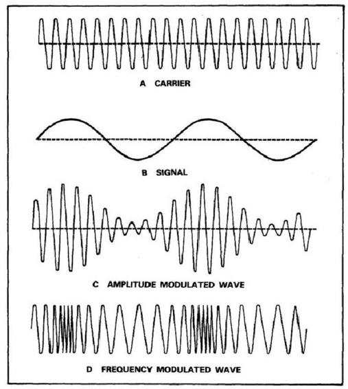
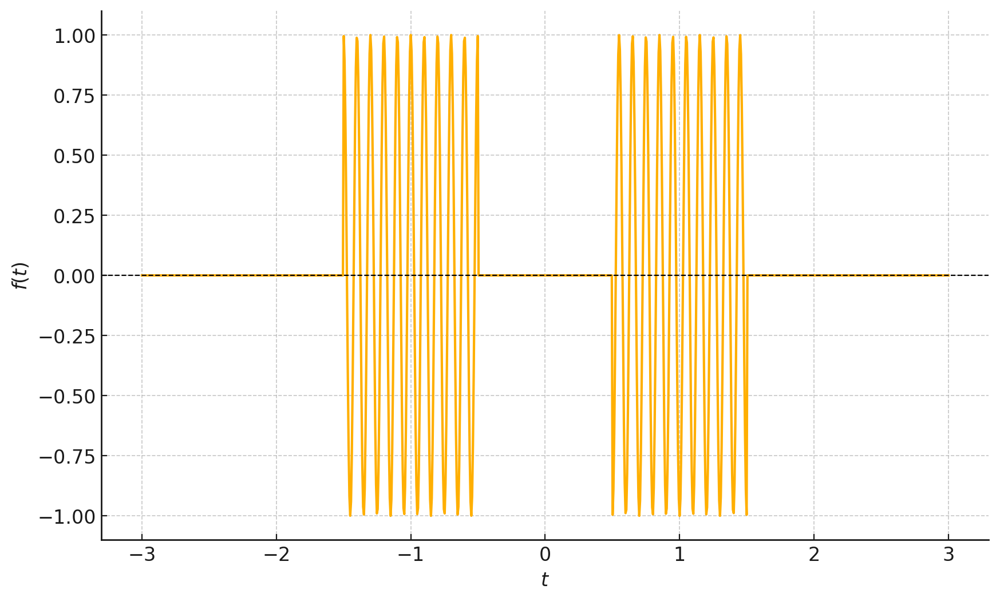
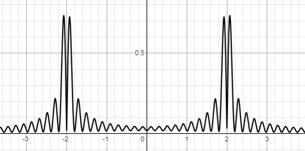

# אפנון פאזה (PM) ואפנון תדר (FM)

### אפנון PM

כמו מקודם נתחיל "בנוסחא" של האפנון

$$g_{PM}\left(t\right)=\cos\left(\omega_{0}t+\phi_{0}+mf\left(t\right)\right)$$

זה דיי מתבקש, במקום לאפנן את המידע על האמפליטודה עכשיו נאפנן אותו על הפאזה.

יתרונות:
* עוצמת שידור קבועה. גם אם יש רעש חזק וגם אם יש שקט
* קל יותר לקלוט? תלוי את מי שואלים

בפועל משתמשים כמעט אך ורק ב-FM שנראה עוד מעט שהוא מקביל לחלוטין ל-PM

### אפנון FM

על מנת להגדיר שידור FM נשאל את השאלה מה הוא "התדר בכל זמן". 
השאלה הזו צריכה לצרום לכם מאוד חזק. מה זה תדר בזמן מסויים!?
תדר הוא משהו לא לוקאלי בזמן. להפך, ככל שמתמקדים יותר בנקודת זמן ספציפית
(כלומר יש לנו פיסה קצרה יותר מהאות) נוכל לדעת פחות טוב מה הם התדרים שמשתתפים באות

מכאן מגיעה מסכנה ראשונה:

```{warning}
תדר רגעי הוא **לא** התדר מפירוק פורייה $\underset{\text{ןמזב}}{\underbrace{\omega\left(t\right)}}\ne\underset{\text{רדתב}}{\underbrace{\tilde{F}\left(\omega\right)}}$ 
```

נשאלת השאלה מה הוא כן? יש לנו אינטואיציה לגבי זה. היינו רוצים לומר שליצור $\cos\left(\omega_{0}t\right)$ יש תדר קבוע של $\omega_{0}$. 
והיינו רוצים שזאת תהיה תכונה לוקאלית. כלומר שאם באזור מסויים של הפונקצייה היא מתנהגת כמו $\cos\left(\omega_{0}t\right)$ אז נומר שיש לה שם תדר $\omega_{0}$.

נציע הגדרה:

$$\omega\left(t\right)\equiv\frac{d\phi\left(t\right)}{dt}$$

נחזור עוד מעט להבנה טובה יותר של מאיפה הגיע ההגדרה הזו

אבל עכשיו נוכל לדרוש:

$$\omega\left(t\right)=\omega_{0}+mf\left(t\right)$$
$$\phi\left(t\right)=\intop_{0}^{t}\omega_{0}+mf\left(t\right)dt+\phi_{0}$$

וקיבלנו כי:

$$g_{FM}\left(t\right)=\cos\left(\omega_{0}t+\phi_{0}+\intop_{0}^{t}mf\left(t\right)dt\right)$$

```{admonition} הקשר בין PM ל-FM:
:class: tip
אפנון FM הוא אפנון PM של האות $\intop_{0}^{t}mf\left(t\right)dt$
```

 נשווה בין שלושת האפנונים האנלוגים


נשים לב שבנקודות שהאות מקבל מקסימום:
* AM מקבל מקסימום אמפליטודה
* FM מקבל תדר רגעי מקסימלי
* PM נמצא בתדר רגעי של הגל הנושא משום שהנגזרת היא 0

### האות האנליטי
ננסה לחשוב קצת יותר על התדר הרגעי. מאיפה הבאנו אותו. הסתכלנו על הפונקצייה $\cos\left(\phi\left(t\right)\right)$ שמלבד לעובדה שהיא חסומה בין מינוס 1 ל-1 אין בה משהו מיוחד.
הסתכלנו על זמן קצר ורשמנו כי:

$$\phi\left(t_{0}+\Delta t\right)=\phi\left(t_{0}\right)+t\left.\frac{d\phi\left(t\right)}{dt}\right|_{t_{0}}$$

 כלומר קירוב סדר ראשון לשינוי בפאזה את מהירות השתנות הפאזה הגדרנו בעזרת התדר הרגעי.
 באיזה עוד דרך ניתן להגיע לזה? אם נוסיף לאות שלנו אות מרוכב $\sin\left(\phi\left(t\right)\right)$
נקבל:
 
$$\cos\left(\phi\left(t\right)\right)+i\sin\left(\phi\left(t\right)\right)=e^{i\phi\left(t\right)}$$

היינו רוצים שתדר רגעי תמיד יהיה חיובי. נציין כאן שזה לא תמיד אפשרי אם אנחנו רוצים שהפאזה תהיה רציפה. אבל משום שאת כל הסימנים 
ניתן לבלוע בפאזה $\cos\left(-\omega_{0}t\right)=\cos\left(\omega_{0}t\right),\sin\left(-\omega_{0}t\right)=\sin\left(\omega_{0}t+\pi\right)$
כלומר לא נוכל להבדיל בין תדרים רגעיים שליליים וחיוביים (אם יש לנו רק את החלק הממשי). ולכן נרצה שהפונקציה $\phi\left(t\right)$ תהיה **פונקציה מונוטונית עולה**

```{warning}
האם שהמתמטיקה כאן היא טיפה טריקית משום שאנחנו מניחים מלחתחילה שנתון לנו האות $e^{i\phi\left(t\right)}$ כאשר
מה שבאמת יש לנו הוא האות $\cos\left(\phi\left(t\right)\right)$. אנחנו צריכים תהליך לקבל אות
מרוכב מאות ממשי ויש לתהליך הזה אינסוף אופציות כאשר מייצגים את האות בתור מעטפת כפול פאזה
$A\left(t\right)\cos\left(\phi\left(t\right)\right)$אנחנו לא ניכנס לדיון הארוך הזה אבל כן 
נשאיר לקורא הסקרן קישור למאמר מקיף על הנושא שעושה קצת סדר במתמטיקה ובהגדרות:
[Estimating and interpreting the instantaneous frequency of a signal. I. Fundamentals](https://doi.org/10.1109/5.135376)
```

נקבל כי:

$$\left|\frac{de^{i\phi\left(t\right)}}{dt}\right|=\left|\frac{d\phi\left(t\right)}{dt}e^{i\phi\left(t\right)}\right|=\left|\frac{d\phi\left(t\right)}{dt}\right|=\frac{d\phi\left(t\right)}{dt}$$

באופן כללי עבור האות:

$$f_{a}\left(t\right)=\left|A\left(t\right)\right|e^{i\phi\left(t\right)}$$
$$\frac{d\phi\left(t\right)}{dt}=\left|\frac{d}{dt}\left(\frac{f_{a}\left(t\right)}{\left|f_{a}\left(t\right)\right|}\right)\right|$$

מה שדרוש לנו היא דרך לקחת אותות מהצורה $f\left(t\right)=\Re\left[\left|A\left(t\right)\right|e^{i\phi\left(t\right)}\right]$
ולהפוך אותם ל-$f_{a}\left(t\right)=\left|A\left(t\right)\right|e^{i\phi\left(t\right)}$

האות המרוכב $f_{a}\left(t\right)$ נקרא האות האנליטי של $f\left(t\right)$. זה נראה שאנחנו "מוסיפים" מידע שאין לנו אבל האמת היא הפוכה. נסתכל על האות במרחב התדר

$$\tilde{F}_{a}\left(\omega\right)=\mathcal{F}\left[f_{a}\left(t\right)\right]$$
$$\Downarrow$$
$$\tilde{F}\left(\omega\right)=\mathcal{F}\left[\Re\left[f_{a}\left(t\right)\right]\right]=\begin{cases}
\tilde{F}_{a}\left(\omega\right) & \omega>0\\
\tilde{F}_{a}^{\ast}\left(\omega\right) & \omega<0
\end{cases}$$

אבל בגלל שהגדרנו מראש שבפונקציה האנליטית יש רק תדרים חיוביים ברור שאפשר להשיג את הפנוקצייה האנליטית מהפונקציה הממשית.
כל מה שצריך לעשות הוא לרשום כי:

$$f_{a}\left(t\right)=f\left(t\right)+i\mathcal{H}\left[f\left(t\right)\right]$$

כאשר 

$$\mathcal{F}\left[\mathcal{H}\left[f\left(t\right)\right]\right]=\begin{cases}
\tilde{F}_{a}\left(\omega\right) & \omega>0\\
-\tilde{F}_{a}^{\ast}\left(\omega\right) & \omega<0
\end{cases}=sgn\left(\omega\right)\cdot\tilde{F}\left(\omega\right)$$

קיבלנו שהטרנספורם הזה הוא לכפול כל תדר או ב1 או במינוס 1 ולכן זו פעולה שניתן לממש בעזרת מערכת LTI!

נשים לב שלא צריך במציאות אות מרוכב אלא שני ערוצים. אחד שהאות בו הוא החלק הממשי והשני שהאות בו הוא החלק המדומה. את כל הנגזרות והנרמולים אפשר לעשות עם שני החלקים האלו!

```{admonition} פאזה רגעית:
:class: tip
הפאזה הרגעית היא הפאזה של האות האנליטי

טרנספורם הילברט הוא פעולת LTI אשר נותנת את החלק המדומה של האות האנליטי בהינתן החלק הממשי
```

<details>
  <summary>דוגמה לשוני בין תדר רגעי לתדר פורייה</summary>

ניקח את הדוגמא הבאה:

$$f\left(t\right)=\cos\left(\omega_{0}t\right)\left[Rect\left(\frac{t+T}{T}\right)-Rect\left(\frac{t-T}{T}\right)\right]$$

ניתן לראות אותה בסרטוט:


נשים לב שבזמנים של הפולסים התדר הרגעי הוא בבירור $\omega_{0}$
בעוד עם עושים פורייה של האות הזה מקבלים:

$$\tilde{F}\left(\omega\right)=\left[\frac{\delta\left(\omega-\omega_{0}\right)+\delta\left(\omega+\omega_{0}\right)}{2}\right]\ast\left[\frac{\left(e^{i\omega T}-e^{-i\omega T}\right)}{\sqrt{2\pi}}Tsinc\left(\omega\frac{T}{2\pi}\right)\right]$$
$$=\left[\frac{\delta\left(\omega-\omega_{0}\right)+\delta\left(\omega+\omega_{0}\right)}{2}\right]\ast\left[2\frac{\sin\left(\omega T\right)}{\sqrt{2\pi}}Tsinc\left(\omega\frac{T}{2\pi}\right)\right]$$

או בסרטוט:


בקצרה מקבלים כי:

$$\boxed{\tilde{F}\left(\omega_{0}\right)=0}$$

כלומר שהתדר הזה בכלל לא נמצא בפורייה של האות!

</details>


### הגדרות לתדר
עד עכשיו נתקלנו בשתי הגדרות לתדר. אני רוצה להוסיף אחת שלישית

* המקדם $\tilde{F}\left(\omega\right)$ של הרכיב $e^{i\omega t}$ בטרנספורם פורייה 
* תדר רגעי - $\omega\left(t\right)\equiv\frac{d\phi\left(t\right)}{dt}$
* נגדיר משהו שיותר קרוב לאיך שאנחנו שומעים, טרנספורם פורייה עם הפרדה בזמן $X_{STFT}\left(\omega,t\right)=\intop_{t-T}^{t}f\left(t\right)e^{-i\omega t^{\prime}}dt^{\prime}$

$$X_{STFT}\left(\omega,t\right)=\intop_{t-T}^{t}f\left(t\right)e^{-i\omega t^{\prime}}dt^{\prime}=\intop_{-\infty}^{\infty}Rect_{T}\left(t^{\prime}-t\right)f\left(t\right)e^{-i\omega t^{\prime}}dt^{\prime}=$$
$$=\mathcal{F}\left[Rect_{T}\left(t^{\prime}-t\right)\right]\ast F\left(\omega\right)=e^{i\omega t}sinc\left(T\omega\right)\ast F\left(\omega\right)$$

קיבלנו שהספקטרוגרמה היא הפורייה של האות מרוחה בתדר. נשים לב שיש לנו טריידאוף בין רזולוציה תדרית לרזולוציה זמנית 
בעזרת שינוי של הפרמטר $T$. נקבל כי:
* ברזולוציה בתדר - $\Delta\omega=\frac{2\pi}{T}$
* ברזולוציה בזמן - $\Delta t=T$
נקבל שוב תוצאה חשובה:

$$\Delta t\cdot\Delta f=1$$

אני מזמין אתכם לשחק קצת עם ספקטרוגרמות ואיך הן נראות באתר הזה:
[ספקטרוגרמה](https://spectrogram.sciencemusic.org/)


עד כאן הסקירה של "ההגדרות" השונות לתדר

### גילוי FM
כבר יש לנו רמז לאיך נבצע גילוי. מה יקרה אם נבצעה גזירה?

$$\frac{d}{dt}g_{FM}\left(t\right)=\frac{d}{dt}\cos\left(\omega_{0}t+\phi_{0}+\intop_{0}^{t}mf\left(t\right)dt\right)$$
$$=\frac{d}{dt}\left(\omega_{0}t+\phi_{0}+\intop_{0}^{t}mf\left(t\right)dt\right)\sin\left(\omega_{0}t+\phi_{0}+\intop_{0}^{t}mf\left(t\right)dt\right)$$
$$=\underset{A\left(t\right)}{\underbrace{\left(\omega_{0}+mf\left(t\right)\right)}}\sin\left(\omega_{0}t+\phi_{0}+\intop_{0}^{t}mf\left(t\right)dt\right)$$

מה קיבלנו? אם נניח כי התדר הרגעי קטן מהתדר הנושא $\frac{d\phi\left(t\right)}{dt}\ll\omega_{0}$ נקבל כי הגל 
הזה הוא פשוט אפנון AM. כלומר נוכל להשתמש בשיטות הקודמות על מנת לקלוט אותו.

```{admonition} קליטת FM:
על מנת לקלוט FM ניתן להעביר אותו במעגל גזירה ואז לבצע גילוי AM
```

חשוב לציין שצריך לעשות גילוי לא קוהרנטי משום שהאות הוא לא בדיוק אפנון
AM אלא אפנון AM עם רעש פאזה משמעותי (כלומר הגל הנושא משנה את התדר שלו לפי המידע) ולכן
צריך להשתמש בגילוי לא קוהרנטי אשר לא רגיש לפאזה!

### רוחב סרט של אפנון PM
נציין שהניתוח עבור אות כללי הוא מורכב אנליטית. ננסה לקחת אות פשוט 
ולנתח אותו. ניקח:

$$\phi\left(t\right)=\sin\left(\omega_{m}t\right)$$
$$g_{PM}\left(t\right)=\cos\left(\omega_{0}t+\beta\sin\left(\omega_{m}t\right)\right)$$

חשוב לדעת איך האות נראה בתדר כדי להבין איך הוא יראה במוצא של כל מערכת LTI
כמו כל פילטר שנשים במקלט או באנטנת השידור

נשתמש בנוסחה טריגונומטרית:
$$g_{PM}\left(t\right)=\cos\left(\omega_{0}t\right)\cos\left(\beta\sin\left(\omega_{m}t\right)\right)+\sin\left(\omega_{0}t\right)\sin\left(\beta\sin\left(\omega_{m}t\right)\right)$$

נחקור רק את החלק הראשון משום שהשני יהיה דומה:

$$\mathcal{F}\left[\cos\left(\omega_{0}t\right)\cos\left(\beta\sin\left(\omega_{m}t\right)\right)\right]=\left[\frac{\delta\left(\omega-\omega_{0}\right)+\delta\left(\omega+\omega_{0}\right)}{2}\right]\ast\mathcal{F}\left[\underset{\text{ירוזחמ}}{\underbrace{\cos\left(\beta\sin\left(\omega_{m}t\right)\right)}}\right]$$
$$=\left[\frac{\delta\left(\omega-\omega_{0}\right)+\delta\left(\omega+\omega_{0}\right)}{2}\right]\ast\left(\sum_{n=-\infty}^{\infty}J_{n}\delta\left(\omega-n\cdot\omega_{m}\right)\right)$$

כלומר מה שמשנה הם הקבועים $J_{n}\left(\beta\right)$ החישוב המדוייק לא מאוד משנה (רמז פונקציות בסל)
אבל העיקר הוא לראות שאנחנו מקבלים המון "הרמוניות" כלומר רוחב סרט
שהוא אפקטיבית מאוד מאוד גדול
למזלנו יש כלל אצבע שאומר כמה האות באמת דואך (כלומר מה הדאיכה של המקדמים)

$$\Delta\omega=2\omega_{max}\left(\beta+1\right)$$ 

וגם כאן נשים לב שעבור $\beta\ll1$ נקבל רוחב סרט "כפול" ממה שרצינו

איך נראה אות FM בפועל? אפשר פשוט לבדוק :) מזל שיש מספיק חובבים של רדיו ברחבי העולם
נבדוק מה קורה
[בניוזילנד](https://openwebrx.zl3bcj.duckdns.org/#freq=106500000,mod=wfm,sql=-150)
 שימו לב שאתם צריכים לבחור את התדר Clone RTL: Hauraki

אם הקישור הזה כבר לא עובד מוזמנים לחפש בעצמכם כאן על המפה מקלטים אחרים:
[OpenWebRX](https://rx-tx.info/map-sdr-points)