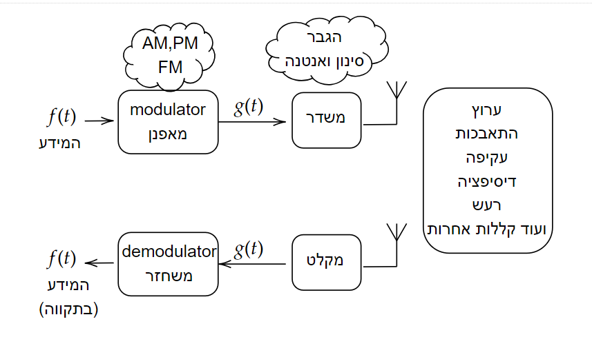

# תקשורת אנלוגית

### מבוא

```{admonition}  המטרה
:class: tip
שידור אות אנלוגי כלשהו המשתנה בזמן $f\left(t\right)$ כך שנוכל לקלוט אותו בצורה מיטבית מרחוק
```

בפועל נעשה את זה על ידי בחירה שיטה מוסכמת בה המידע עובר.
"לשיטה" הזאת נקרא אפנון (modulation)

נאפנן האות שלנו $f\left(t\right)$ על גבי גל נושא (carrier wave) בתדר $\omega_{0}$ שאינו בהכרח קשור לתדרי המידע $\tilde{F}\left(\omega\right)$

### מבנה סכמטי של תקשורת אנלוגית



מדוע בכלל לשדר על גל נושא? למה לא לשדר פשוט את המידע כמו שהוא?
* ניתן להפריד אותות שונים בשידור ובקליטה "multiplexing" נגיד שידור במספר ערוצים כמו תחנות רדיו
* לפעמים זה יעזור לנו להיות מותאמים יותר למערכת השידור הקליטה או התווך עצמו - נניח אם יש תדר שדואך מאוד מהר באוויר
* אנחנו יכולים מאוד להגדיל את גורם הטיב שלנו $Q=\frac{\omega_{0}}{\Delta\omega}$ בכך שאנחנו מגדילים את תדר השידור

חשוב לציין ששום דבר כאן לא באמת מחייב. זאת הנדסה והמטרה היא לבנות משהו שימושי שעובד בעולם האמיתי. אפילו הייצוג של האותות במרחב התדר לא מחייב
