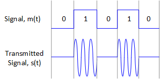
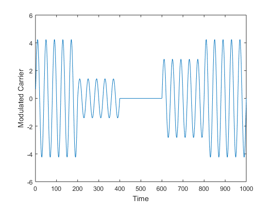
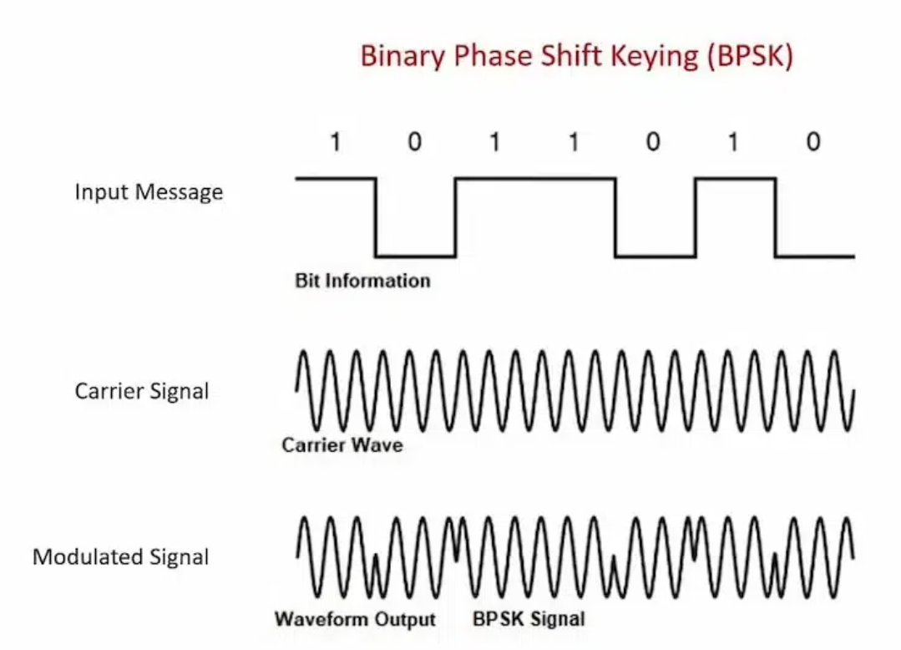
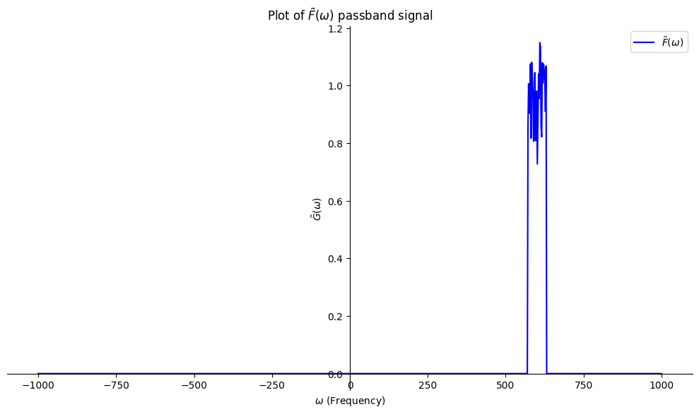
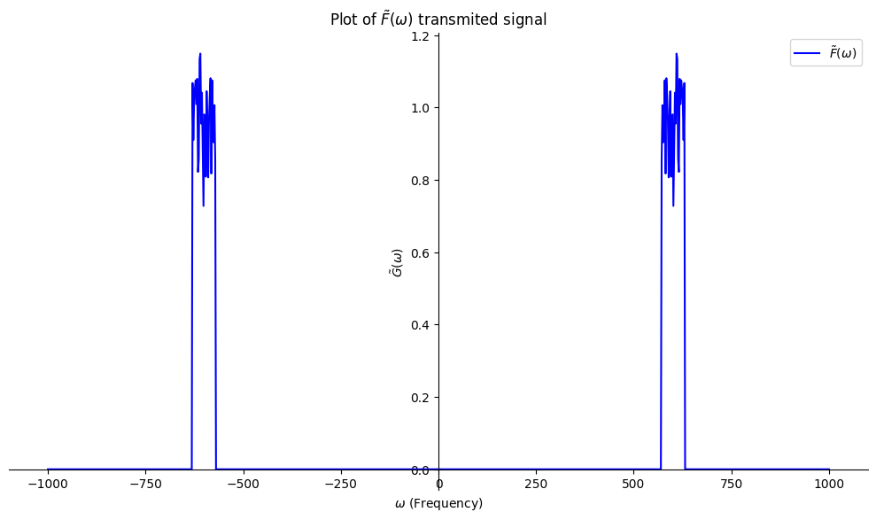
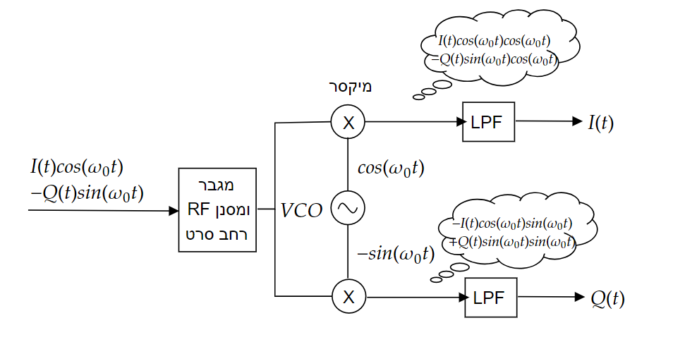
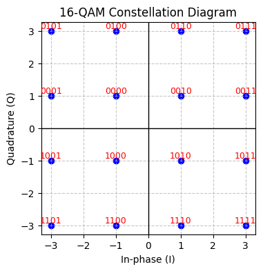
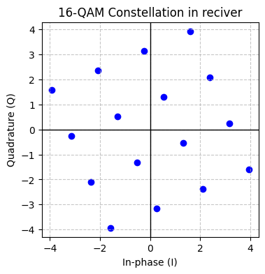

# אפנונים לינארים

<details>
  <summary>אמלק</summary>

ניתן לשדר כל אפנון לינארי בעזרת האות **המרוכב**

$$z\left(t\right)=\left[\sum_{n}s_{n}\delta\left(t-nT_{s}\right)\right]\ast Rect\left(\frac{t}{T_{s}}\right)$$

כאשר המספרים **המרוכבים** $s_{n}$ נקראים סמלים (או symbols) ומייצגים את המידע שאנחנו רוצים לשלוח

בפועל נשדר באוויר את האות **הממשי**: 

$$\Re\left[z\left(t\right)e^{i\omega_{0}t}\right]=I\left(t\right)\cos\left(\omega_{0}t\right)-Q\left(t\right)\sin\left(\omega_{0}t\right)$$
$$I\left(t\right)\equiv\Re\left[z\left(t\right)\right],Q\left(t\right)\equiv\Im\left[z\left(t\right)\right]$$

ונוכל לקבל את $I\left(t\right)$ ואת $Q\left(t\right)$ בעזרת מקלט קוהרנטי

רוחב הסרט של השידור תמיד יהיה:

$$\Delta f=\frac{2}{T_{s}}$$

ואם אנחנו משדרים $M$ סמלים נקבל כי קצב העברת הביטים הוא:

$$bps=\frac{1}{T_{s}}\log_{2}M=\frac{\Delta f}{2}\log_{2}M$$

</details>

בהמשך נראה למה הכותרת נקראת אפנונים לינארים 
בינתיים נתחיל בלחשוב על הדרך הפשוטה והאינטואיטיבת ביותר לשדר מידע
בינארי. למרות השם המוזר BASK הוא מה שעולה לכם בטח בראש

### BASK

השם הוא Binary Amplitude Shift Keying
* Binary - כי הולכים להיות לנו שני סמלים
* Amplitude - כי הסמלים הולכים להיות שונים זה מזה בעוצמה
* Shift Keying - כי אנחנו נאפנן בכך שנעבור בין שני הסמלים השונים

בגדול הרעיון פשוט. נגדיר שני סמלים, נגדיר עוצמה של כל אחד מהם ונקבע כי כאשר אנחנו רוצים לשדר
את הסמל הראשון נשדר בעוצמה שלו וכאשר אנחנו רוצים לשדר את הסמל השני נשדר בעוצמה שלו.
כלומר נשדר בעוצמה גבוהה כאשר אנחנו רוצים לשדר את הסמל הראשון ובעוצמה נמוכה כאשר אנחנו רוצים לשדר את הסמל השני.
המיפוי בין סמלים לביטים גם הוא פשוט. החזק יהיה 1 והחלש יהיה 0 (או הפוך)
הרבה פעמים החלש יהיה בעוצמה 0 מה שנותן את התמונה הבאה

נשים לב שאנחנו תמיד נשדר על תדר נושא ולכן הכל יהיה כפור קוסינוס
לרוב נהוג לרשים את האפנון בצורה הבאה:

$$g\left(t\right)=s\left(t\right)\cos\left(\omega_{0}t\right)$$
$$s\left(t\right)=\sum_{n}a_{n}Rect\left(\frac{t-nT_{s}}{T_{s}}\right)=\left[\sum_{n}a_{n}\delta\left(t-nT_{s}\right)\right]\ast Rect\left(\frac{t}{T_{s}}\right)$$

כלומר סימבולים כפול גל נושא 

איך נראה הספקטרום של שידור כזה?

$$\tilde{G}\left(\omega\right)=\underset{\text{ליגרכ}}{\underbrace{\left[\frac{\delta\left(\omega-\omega_{0}\right)+\delta\left(\omega+\omega_{0}\right)}{2}\right]}}\ast\left[\mathcal{F}\left[\sum_{n}a_{n}\delta\left(t-nT_{s}\right)\right]\cdot T_{s}sinc\left(\omega\frac{T_{s}}{2\pi}\right)\right]$$

כאשר השתמשנו בהגדרה המנורמלת של SINC $sinc\left(x\right)=\frac{\sin\left(\pi x\right)}{\pi x}$

קיבלנו שהאפנון הוא בצורת $sinc$ כפול פורייה של רכבת הלמים עם מקדמים של 0 או 1

רוחב הסרט וקצב העברת המידע הם:

$$\Delta\omega=\frac{4\pi}{T_{s}}\Rightarrow\Delta f=\frac{2}{T_{s}}=2bps$$

כלומר ככל שאנחנו שולחים יותר ביטים בשניה כך הרוחב יהיה גדול יותר

זה  אומר שממש קל לזכור! אם רוצים שידור שיעביר $1M\frac{bit}{sec}$ נצטרך רוחב
של 2MHZ וכו. (חשוב לזכור שלרוב כשרושמים  $1\frac{Mb}{sec}$ מתכוונים ל-byte)

לדוגמא שידור של GPS (ממש דומה ונגיע לBPSK עוד רגע) הוא בקצב של $T_{s}=\frac{1ms}{1023}\approx10^{-6}s$
ולכן רוחב הסרט שלו הוא בערך 2MHZ

###MASK
נית ן לא לשנות את קצב הסימבולים בכלל אבל לשדר יותר ביטים. איך?
אם יהיו לנו יותר סימבולים לשדר נגיד 4 במקום 2 נוכל שכל אחד מהם
ייצג יותר מביט בודד.

לדוגמא:

$$\underset{s_{1}}{\underbrace{00}}\underset{s_{2}}{\underbrace{01}}\underset{s_{3}}{\underbrace{10}}\underset{s_{4}}{\underbrace{11}}$$

כאן בעזרת 4 סימבולים אנחנו משדרים 2 ביט לכל סימבול
עכשיו במקום 2 רמות של אמפליטודה נשתמש ב-4 כמו בתמונה:


ובאופן כללי יותר ניתן לחלק את טווח האמפליטודות שאנחנו יודעים
לשדר ל-$M$ רמות שונות. כל רמה (או סימבול) ייצג $\log_{2}M$ ביטים נקבל
קצב השידור הוא:

$$bps=\frac{1}{T_{s}}\log_{2}M=\frac{\Delta f}{2}\log_{2}M$$

איך האות יראה בתדר? תכלס אותו הדבר... מה ששונה הם רק המקדמים של
הדלתאות

אז למה לא להשתמש באינסוף רמות? כי במציאות יש רעש ונוכל בהמשך לחשב
את כמות השגיאות שנקבל כשננסה לקלוט את האות

###BPSK
אם עד עכשיו דיברנו על לאפנן ASK כלומר על האמפליטודה עכשיו נאפנן
על הפאזה. אני רוצה אבל שהחלוקה הזאת לא תהיה לכם בראש.
באפנון אנלוגי יש הרבה שוני בין AM ל-PM ו-FM באיך הם נראים בתדר
באיך בונים משדר ומקלט. באופן כללי הם שונים גם בהתנהגות שלהם בשידור.
באפנונים אנלוגים שנראה היום אין את ההבדל הזה. הסיבה היא שהבחירה המרכזית
שלנו הייתה לשדר "מלבנים" שלכל אחד מהם יש פקטור שמייצג את המידע.

ניקח את הדוגמא הבאה בתור שבאה לראש, למה לא לשדר אמפליטודות של $\pm1$?

אז האמת שאפשר. זה יקרא BPSK כי נתייחס לשידור הזה בתור שידור של שתי פאזות שונות $1=e^{i\cdot0},-1=e^{i\pi}$
כלומר שתי פאזות בהפרש של $\pi$. למה אנחנו מסתכלים על זה ככה?
משום שאחרי שמכפילים בגל הנושא מקבלים משהו שנראה ככה:


כלומר הפאזה של התדר הנושא מתהפכת ב-$\pi$ כל שינוי של ביט מ0 ל1 או להפך

חשוב לשים לב שהנוסחא $s\left(t\right)=\left[\sum_{n}s_{n}\delta\left(t-nT_{s}\right)\right]\ast Rect\left(\frac{t}{T_{s}}\right)$
עדיין נכונה (נעבור לסמן את המקדמים ב-$s_{n}$ כי אלו בעצם הסימבולים שלנו)

מה בפועל משודר?

נשים לב שאם נייצג את הביטים בתור $b_{n}$ נוכל לרשום:

$$s_{n}=\begin{cases}
1 & b_{n}=1\\
-1 & b_{n}=0
\end{cases}=2b_{n}-1$$

כלומר:

$$b\left(t\right)\equiv\frac{s\left(t\right)+1}{2}=\left[\sum_{n}b_{n}\delta\left(t-nT_{s}\right)\right]\ast Rect\left(\frac{t}{T_{s}}\right)$$
$$g_{BPSK}\left(t\right)=s\left(t\right)\cos\left(\omega_{0}t\right)=\left(2b\left(t\right)-1\right)\cos\left(\omega_{0}t\right)$$

וקיבלנו שוב משהו שמאוד דומה לאפנון מעטפת. חשוב אבל לשים לב שגודל
האמפליטודה בזמן לא משתנה ולכן לא נוכל לבצע גילוי לא קוהרנטי!

כמו בשידור BASK נקבל כי:

$$bps=\frac{1}{T_{s}}=\frac{\Delta f}{2}$$

האם נוכל להכליל את הרעיון של MASK לBPSK? והפעם לבחור:

$$s_{n}\in\left\{ e^{2\pi i\frac{m}{M}}\right\} _{m=0}^{M-1}$$

כלומר לא 2 פאזות אלא $M$. בלי התדר הנושא לא ברור איך עושים את זה
אבל עם התדר הנושא זה קצת יותר ברור. נשדר:

$$\cos\left(\omega_{0}t+\arg\left(s_{n}\right)\right)\cdot Rect\left(\frac{t}{T_{s}}\right)$$

לדוגמא עבור $M=4$ נקבל:

* 00: $\cos\left(\omega_{0}t\right)$
* 01: $\cos\left(\omega_{0}t+\frac{\pi}{2}\right)=-\sin\left(\omega_{0}t\right)$
* 10: $\cos\left(\omega_{0}t+\pi\right)=-\cos\left(\omega_{0}t\right)$
* 11: $\cos\left(\omega_{0}t+\frac{3\pi}{2}\right)=-\sin\left(\omega_{0}t\right)$

אבל זה לא נראה כמו מקודם. היינו רוצים להישאר עם הנוסחה שלנו של $s\left(t\right)=\left[\sum_{n}s_{n}\delta\left(t-nT_{s}\right)\right]\ast Rect\left(\frac{t}{T_{s}}\right)$
אבל לשים בתוכה את המספרים המרוכבים. בשביל זה יש לנו "טריק" מתמטי מאוד נוח

### מרחב הסמלים ואות ה-baseband

האות שאנחנו משדרים בסוף הוא סימטרי סביב 0 אבל הוא מאופנן בתדר גבוה $\omega_{0}$.
אין שום דבר שמכריח אותו להיות סימטרי (עם הצמדה כמובן) סביב $\omega_{0}$
אבל כל פעם ששידרנו אות מהצורה $g\left(t\right)=s\left(t\right)\cos\left(\omega_{0}t\right)$
זה מה שקיבלנו כי $s\left(t\right)$ חייב להיות ממשי! איך נתחמק מזה?

נניח שאנחנו רוצים לייצר אות שממורכז סביב $\omega_{0}$ אבל הוא לא סימטרי
איזה אות נבחר?

נכול לבחור אות מהצורה:

$$z\left(t\right)e^{i\omega_{0}t}$$

כאשר כמובן ש$z\left(t\right)$ מרוכב. איך זה יראה?
האות יראה כמו בתמונה:



אנחנו לא יכולים לשדר אות כזה. נצטרך לשדר אות שמכיל גם שיקוף של האות הזה לתדרים השליליים
על מנת לדאוג שמה שאנחנו משדרים יהיה ממשי. איך נעשה את זה?
פשוט נשדר את $\Re\left[z\left(t\right)e^{i\omega_{0}t}\right]$

איך הוא יראה? פשוט עם שיקוף!


ומה תהיה הנוסחא שלו?

$$\Re\left[z\left(t\right)e^{i\omega_{0}t}\right]=\Re\left[\left(\Re\left[z\left(t\right)\right]+i\Im\left[z\left(t\right)\right]\right)\left(\cos\left(\omega_{0}t\right)+i\sin\left(\omega_{0}t\right)\right)\right]$$
$$=\Re\left[z\left(t\right)\right]\cos\left(\omega_{0}t\right)-\Im\left[z\left(t\right)\right]\sin\left(\omega_{0}t\right)$$

נסמן $I\left(t\right)\equiv\Re\left[z\left(t\right)\right],Q\left(t\right)\equiv\Im\left[z\left(t\right)\right]$ ונקבל כי:

$$\boxed{\Re\left[z\left(t\right)e^{i\omega_{0}t}\right]=I\left(t\right)\cos\left(\omega_{0}t\right)-Q\left(t\right)\sin\left(\omega_{0}t\right)}$$

כלומר אם אנחנו רוצים לשדר אות לא סימטרי סביב $i\omega_{0}$ נצטרך
להשתמש גם ב-$\cos\left(\omega_{0}t\right)$ וגם ב-$\sin\left(\omega_{0}t\right)$
כדי לשדר.

הרבה פעמים אנחנו נקצר את התהליך ופשוט נומר שאנחנו רוצים לשדר את האות
$z\left(t\right)=I\left(t\right)+iQ\left(t\right)$ בתדר הנושא $\omega_{0}$

האות  $z\left(t\right)=I\left(t\right)+iQ\left(t\right)$ יקרא האות ב-baseband ובדוגמא שלנו
הוא יראה ככה:


אז הסכמה מעכשיו הולכת ככה:
1. מייצרים אות מרוכב $z\left(t\right)=I\left(t\right)+iQ\left(t\right)$ סביב תדר 0
2. מעלים אותו לתדר הנושא על ידי הכפלה ב$e^{i\omega_{0}t}$
3. משדרים את $\Re\left[z\left(t\right)e^{i\omega_{0}t}\right]=I\left(t\right)\cos\left(\omega_{0}t\right)-Q\left(t\right)\sin\left(\omega_{0}t\right)$

ומה בקליטה? למה לנו בכלל לדבר על האות המרוכב? נחזור להסתכל על המקלט הקוהרנטי שלנו 
אבל הפעם נוסיף לו עוד ערוץ:


כלומר אנחנו מקבלים שני פלטים אחד של $I\left(t\right)$ והשני של $Q\left(t\right)$

```{admonition} IQ:
מעכשיו במקום לחשוב על זה שאנחנו מוגבלים לשידור של אותות ממשיים אנחנו יכולים לחשוב
על שידור וקליטה של שידורים מרוכבים $z\left(t\right)=I\left(t\right)+iQ\left(t\right)$

איך נעשה את זה? נשדר באוויר $I\left(t\right)\cos\left(\omega_{0}t\right)-Q\left(t\right)\sin\left(\omega_{0}t\right)$ ובעזרת
מקלט קוהרנטי נקבל את $I\left(t\right)$ ואת $Q\left(t\right)$
```

נוכל להציג את מה שאנחנו קולטים בכל נקודת זמן במישור כאשר ציר ה-x  הוא $I\left(t\right)$
וציר ה-y הוא $Q\left(t\right)$ תרשים זה יקרא **מרחב הסמלים**

נחזור לשידור של MPSK. איך הוא נראה השידור ב-baseband?

$$z\left(t\right)=\left[\sum_{n}s_{n}\delta\left(t-nT_{s}\right)\right]\ast Rect\left(\frac{t}{T_{s}}\right),s_{n}\in\left\{ e^{2\pi i\frac{m}{M}}\right\} _{m=0}^{M-1}$$

כלומר אות מרוכב! אותו נשדר כמו שאמרנו לפני רגע. זה אומר שכאשר אנחנו שואלים מה הקלט בזמן כלשהו $t_{n}=n\cdot T_{s}+\varepsilon$ כלומר במהלך הסימבול ה-$n$

$$r\left(t_{n}\right)=\begin{pmatrix}I\left(t_{n}\right)\\
Q\left(t_{n}\right)
\end{pmatrix}=\begin{pmatrix}\Re\left[z\left(t_{n}\right)\right]\\
\Im\left[z\left(t_{n}\right)\right]
\end{pmatrix}=\begin{pmatrix}\Re\left[s_{n}\right]\\
\Im\left[s_{n}\right]
\end{pmatrix}=\begin{pmatrix}\cos\left(2\pi\frac{m}{M}\right)\\
\sin\left(2\pi\frac{m}{M}\right)
\end{pmatrix}$$

תכלס עכשיו אתם אמורים להבין שכל האפנונים הלינארים "הם אותו הדבר" פשוט בוחרים סמלים שונים
וזה לא באמת משנה אם מאפננים באמפליטודה או בפאזה או בשניים יחד

לכל אפנון נעשה תרשים של הסמלים השונים (נקרא גם תרשים קונסטלציה)



משהו חמוד לחשוב עליו: כמה ביטים שונים בין שני סימבולים צמודים בכל אחת מהקונסטליות האלו?
מה היינו רוצים?

עכשיו אתם גם מוזמנים לחשוב על השאלה למה האפנונים האלו נקראים לינארים?
מה לינארי בהם? מה קורה אם שאני אנשים משדרים באותו תדר נושא?

<details>
  <summary>למתקדמים, טעויות פאזה</summary>
בפועל האות שאנחנו הולכים לקלוט לא יהיה מסונכרן בפאזה עם המקלט הקוהרנטי ולכן
אנחנו קולטים אות מהצורה:

$$I\left(t\right)\cos\left(\omega_{0}t+\phi_{0}\right)-Q\left(t\right)\sin\left(\omega_{0}t+\phi_{0}\right)$$

במוצא המקלט נקבל:

$$r\left(t\right)=\begin{pmatrix}I\left(t\right)\cos\left(\phi_{0}\right)\\
Q\left(t\right)\sin\left(\phi_{0}\right)
\end{pmatrix}\Rightarrow r_{c}\left(t\right)=z\left(t\right)e^{i\phi_{0}}$$

שזה בעצם אומר שכל הקונסטלציות מסתובבות!



איך נתקן את זה? מה אם פעם בכמה סימבולים נדע איזה סימבול אנחנו משדרים?
</details>