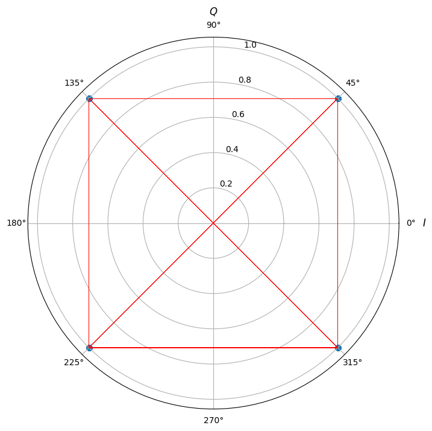
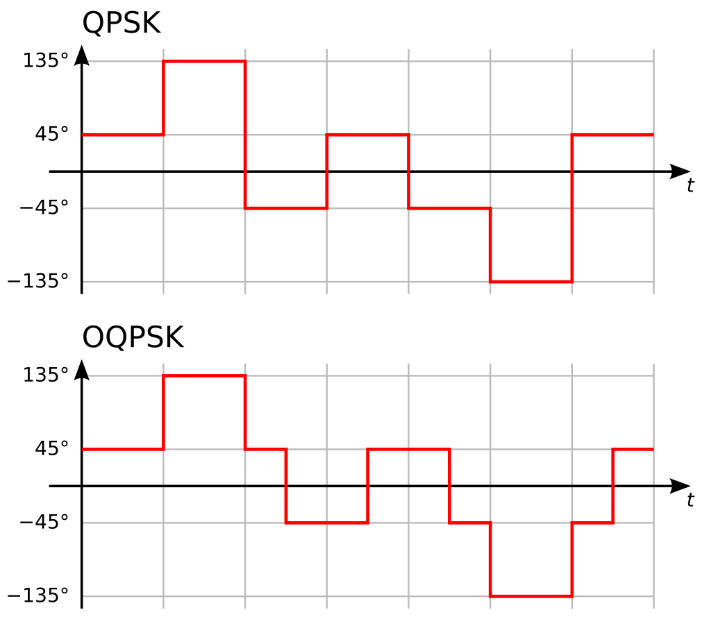
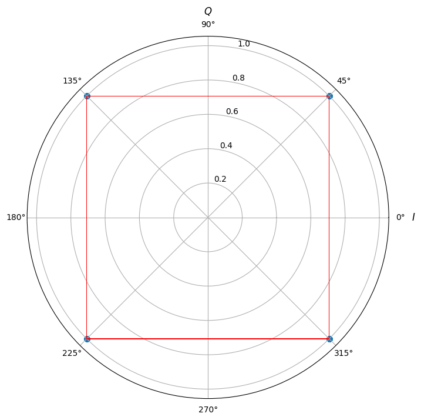

# פתרון בעיות שלא ידעתם שקיימות

הרבה מאוד מההבנה באיזה אפנון להשתמש בכל מערכת ולמה מהנדסים עבדו קשה
כדי למצוא אפנונים חדשים ולהמציא דברים חדשים קשור לבעיות בעולם
התקשורת שקצת קשה לשים לב אליהן מהתבוננות במשוואות. אני
אתן כאן כמה דוגמאות לבעיות שיכולות לצוץ ואיך פתרו אותן

### zero crossing

כאשר משדרים בשידור QPSK ניתן לראות מה שנקרא zero crossing
כלומר ששני סימבולים שקופצים בינהם נמצאים בפאזה של $\pi$ זה מזה
הגל שלנו הוא רציף ולא באמת "מדלג" בין הסימבולים. זה אומר שבדרך
אנחנו אמורים לעבור דרך ה-0.

אם נצייר את הקונסטלציה של QPSK כולל המעברים:

אבל למה זאת בעיה? הסיבה היא שהמטרה באפנון PSK על צורותיו השונות היא
ליצור אפנון שבו המעטפת כלומר האמפליטודה כמעט ולא משתנה.
בטח ובטח שלא מתהפכת דרך ה-0.

כדי לפתור את זה נשתמש בטריק כמובן. אפשר לחשוב על אפנון QPSK
בתור שני אפנוני BASK. אבל אחד משדר על I אחד על Q.
כל אחד מהם מחליף סימן כל $T_{S}=2T_{b}$ וכמובן הם מתחלפים ביחד
מה עם נזיז את הערוץ של Q $T_{b}$ קדימה בזמן? עכשיו הם אף פעם
לא מתחלפים ביחד. אם מסתכלים כל התוצאה מקבלים משהו כזה:

אוקי אפשר לבדוק שוב את המעברים:

נראה שטיפלנו בבעיה. אבל מרגיש שבגלל שעכשיו אנחנו מחליפים פאזה
כל $T_{b}$ יש סיכון שהגדלנו את רוחב הסרט של השידור.

האמת שזה לא קורה. קל לראות את זה מלינאריות של פורייה והזזה בזמן. עבור QPSK רגיל:

$$\mathcal{F}\left[z_{QPSK}\left(t\right)\right]=\mathcal{F}\left[\sum_{n}e^{i\phi_{n}}Rect\left(\frac{t-nT_{s}}{T_{s}}\right)\right]=\mathcal{F}\left[\sum_{n}e^{i\phi_{n}}\delta\left(t-nT_{s}\right)\right]\cdot T_{s}sinc\left(\omega\frac{T_{s}}{2\pi}\right)$$
$$=\left(\mathcal{F}\left[\sum_{n}\cos\left(\phi_{n}\right)\delta\left(t-nT_{s}\right)\right]+i\mathcal{F}\left[\sum_{n}\sin\left(\phi_{n}\right)\delta\left(t-nT_{s}\right)\right]\right)\cdot T_{s}sinc\left(\omega\frac{T_{s}}{2\pi}\right)$$

ועבור OQPSK רק נזיז את הערוץ המדומה:

$$\mathcal{F}\left[z_{OQPSK}\left(t\right)\right]=\left(\mathcal{F}\left[\sum_{n}\cos\left(\phi_{n}\right)\delta\left(t-nT_{s}\right)\right]+i\mathcal{F}\left[\sum_{n}\sin\left(\phi_{n}\right)\delta\left(t-n\left(T_{s}-\frac{T_{s}}{2}\right)\right)\right]\right)\cdot T_{s}sinc\left(\omega\frac{T_{s}}{2\pi}\right)$$
$$=\left(\mathcal{F}\left[\sum_{n}\cos\left(\phi_{n}\right)\delta\left(t-nT_{s}\right)\right]+ie^{i\omega\frac{T_{s}}{2}}\mathcal{F}\left[\sum_{n}\sin\left(\phi_{n}\right)\delta\left(t-nT_{s}\right)\right]\right)\cdot T_{s}sinc\left(\omega\frac{T_{s}}{2\pi}\right)$$

וכמו שראינו עד עכשיו ה-$sinc$ נשאר אותו הדבר ורוחב הסרט נשאר כמו שהוא.

### סנכרון פאזה
כמו שראיתם בפרק הקודם שום דבר לא מבטיח שלנו שהמקלט הקוהרנטי שלנו יהיה בסנכרון
עם האות שמשודר. באופן כללי יש בינהם הפרש פאזה $\Delta\phi$

זה אומר שהסימבולים שנקלוט יהיו:

$$r\left(t\right)=\begin{pmatrix}I\left(t\right)\cos\left(\Delta\phi\right)\\
Q\left(t\right)\sin\left(\Delta\phi\right)
\end{pmatrix}$$

או בסימונים אחרים:

$$r\left(t\right)=z\left(t\right)e^{i\Delta\phi}$$

יש לנו שתי בעיות. הראשונה היא שהערוצים מעורבבים. את זה אפשר לפתור בדרכים שונות
לדוגמא עבור BPSK נסתכל על:

$$\left(r\left(t\right)\right)^{2}=\left(z\left(t\right)\right)^{2}e^{2i\Delta\phi}$$

בגלל שהסימבולים $z\left(t\right)$ הם או אחד או מינוס 1 קיבלנו כי $\left(z\left(t\right)\right)^{2}=1$
ולכן נוכל לרשום:

$$\Delta\phi=\frac{1}{2}\arg\left(\left(r\left(t\right)\right)^{2}\right)$$

הכל טוב ויפה עד שמבינים שהפונקציה $arg$ מחזירה תשובה עד כדי $2\pi$ וזה אומר שאנחנו
יכולים לדעת את הפרש הפאזות עד כדי $\pi$. אז פתרנו את ערבוב הערוצים אבל
אנחנו לא יכולים לדעת איזה סימבול הוא 0 ואיזה הוא 1. מה אפשר לעשות?

אחד הפתרונות שמשתמשים בהם הוא אפנון שנקרא DBPSK. באפנון הזה
המידע הוא לא הסימבולים אלא המעברים בינהם. אם רוצים לשלוח את הביט 0 נשארים
באותו סימבול. אם רוצים לשלוח את הביט 1 מחליפים.
אפנון כזה לא דורש סנכרון פאזה משום שאנחנו מעוניינים רק בהפרשי פאזות.
כמובן שניתן להכליל את זה לאפנון DPSK שבו יש יותר ממעבר אחד אפשרי.

### ISI - Inter Symbol Interference
בכל החלק על תקשורת עד עכשיו דיברנו על מקלטים כאילו לא למדנו את כל החלק
מערכות לינאריות. במציאות האות עובר החזרים ועובר דרך האוויר. כלומר הוא
מועבר בפונקציית תמסורת!
זה הרבה הרבה יותר גרוע מאשר רק הכפלה בפאזה. כל תדר מוכפל באפליטודה ופאזה משלו.
מה עושים?

נתחיל ממודל "פשוט" (האמת שלא צריך מודל יותר מסובך אבל יהיה קל יותר להבין את זה
אחרי שנדבר על דגימה של אותות)

המודל אומר שכל דגימה שאנחנו מקבלים היא סכום של הדגימה הנוכחית ועוד
החזרות (כל אחת עם פאזה ואפליטודה) כלומר:

$$r_{n}=\sum_{k=0}^{\infty}h_{k}s_{n-k}$$

שימו לב שזה ממש נראה כמו קונבולוציה רק עבור אותות דגומים (או וקטורים אינסופיים)

אנחנו רוצים לקבל את הסימבולים שלנו. איך נעשה את זה?
נתחיל בלהניח הנחה (יחסית טובה) שפונקציית התגובה להלם דואכת בזמן
ואחרי זמן מספיק ארוך היא זניחה. נקבל כי:

$$r_{n}\approx\sum_{k=0}^{K-1}h_{k}s_{n-k}$$

אוקי מה עושים מכאן? אנחנו רוצים לשערך את המספרים $h_{k}$ ויש לנו $K$ כאלו.
מה אם נתחיל כל שידור (או פעם בכמה שניות) נשלח $2K$ סימבולים שאנחנו יודעים מה הם
נתחיל מדוגמה פשוטה בה אנחנו שולחים תמיד רצף של 0 באורך $K$ ואז רצף של 1 באורך $K$ כלומר:

$$s_{n}=\begin{cases}
0 & 0\le n\le K-1\\
1 & K\le n\le2K-1
\end{cases}$$

נקבל  כי:

$$r_{K+l}=\sum_{k=0}^{K-1}h_{k}s_{K+l-k}=\sum_{k=l+1}^{K-1}h_{k}\underset{0}{\underbrace{s_{K+l-k}}}+\sum_{k=0}^{l}h_{k}\underset{1}{\underbrace{s_{K+l-k}}}$$
$$r_{K+l}-r_{K+l-1}=\sum_{k=0}^{l}h_{k}-\sum_{k=0}^{l-1}h_{k}=h_{l}$$

שימו לב שסתם הינדסתי דוגמה קלה, באופן כללי זה פשוט לפתור K משוואות ב-K נעלמים. כלומר פשוט להפוך מטריצה
(האם היא הפיכה? כל עוד אין תדר שהיא מאפסת היא הפיכה)

התהליך הזה של שערוך של פונקציית התגובה לתדר נקרא שערוך ערוץ
ואחריו צריך לבוא תהליך של "ביטול" ערוץ או חלוקה בפונקציית התמסורת.
תהליך זה נקרא equalization.

ראינו כאן שאחת הדרכים לבצע אותו הוא לשלוח כמות מסויימת של סימבולים ידועים
ולפתור סט של משוואות לינאריות

