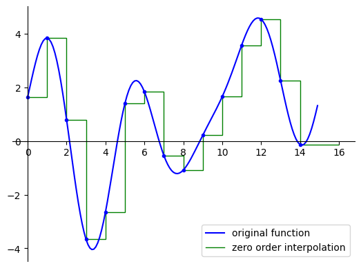
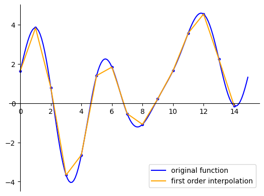
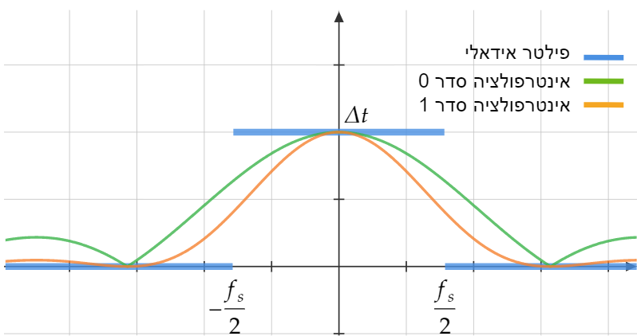

# שחזור (בעזרת אינטרפולציה)

  
אמ;לק

 
ניתן לייצג אינטרפולציה מסדר 0 ומסדר 1 כקונבולוציה ולראות מה האינטרפולציה עושה בתדר:

$$V_{0}\left(\omega\right)=\Delta te^{-i\omega\frac{\Delta t}{2}}sinc\left(\frac{\omega}{2\pi}\Delta t\right)\cdot V_{s}\left(\omega\right)$$
$$V_{1}\left(\omega\right)=\Delta t\left[sinc\left(\frac{\omega}{2\pi}\Delta t\right)\right]^{2}\cdot V_{s}\left(\omega\right)$$

אחרי שראינו שחזור אידאלי בעזרת קונבולוציה עם $sinc\left(f_{s}t\right)$ נחזור לשתי שיטות פשוטות יותר וננסה
לכמת כמה הן טובות

### שחזור מסדר 0
הרעיון הבסיסי הוא פשוט להגדיר את הפונקציה בתור מדרגות
כלומר ערך הפונקציה הוא הערך של הדגימה האחרונה שנתקלנו בה. ברגע שמגיעה הדגימה הבאה משנים את הערך

זה נראה ככה:

איך זה יראה בנוסחא? זה פשוט לעשות קונבולוציה עם מלבן שהאורך שלו הוא המרחק בין דגימות:

$$V_{0}\left(t\right)=Rect\left(\frac{t-\frac{\Delta t}{2}}{\Delta t}\right)\ast V_{s}\left(t\right)$$

זה אומר שבתדר זה נראה ככה:

$$V_{0}\left(\omega\right)=\sqrt{2\pi}e^{-i\omega\frac{\Delta t}{2}}\frac{\Delta t}{\sqrt{2\pi}}sinc\left(\frac{\omega}{2\pi}\Delta t\right)\cdot V_{s}\left(\omega\right)$$
$$V_{0}\left(\omega\right)=\Delta te^{-i\omega\frac{\Delta t}{2}}sinc\left(\frac{\omega}{2\pi}\Delta t\right)\cdot V_{s}\left(\omega\right)$$

זה לא הכפלה במלבן אבל זה לפחות ברוחב "הנכון".

איך נוכל להשתפר קצת? מה אם נחבר את הנקודות באופן קצת יותר חכם?

### שחזור מסדר1
נרצה לחבר את הנקודות באופן לינארי:

איך נכתוב את זה מתמטית? נשים לב לטריק מגניב. אם ניקח את האינטרפולציה סדר 0 שלנו
ונעשה לה עוד הפעם קונבולוציה עם מלבן נקבל אינטרפולציה סדר 1.
נרצה מלבן שקונבולוציה איתו היא ממוצע של הנקודות הבאות עד הדגימה הבאה.
באופן הזה הדגימות עצמן לא יזוזו אבל בכל נקודה בין דגימות נבצע ממוצע משוקלל בינהן.

זה נראה ככה:

$$V_{1}\left(t\right)=V_{0}\left(t\right)\ast\frac{1}{\Delta t}Rect\left(\frac{t+\frac{\Delta t}{2}}{\Delta t}\right)$$

או במרחב התדר:

$$V_{1}\left(\omega\right)=V_{0}\left(\omega\right)e^{-i\omega\frac{\Delta t}{2}}sinc\left(\frac{\omega}{2\pi}\Delta t\right)$$
$$V_{1}\left(\omega\right)=\Delta t\left[sinc\left(\frac{\omega}{2\pi}\Delta t\right)\right]^{2}\cdot V_{s}\left(\omega\right)$$

נסכם בתמונה של איך הכל נראה בתדר

