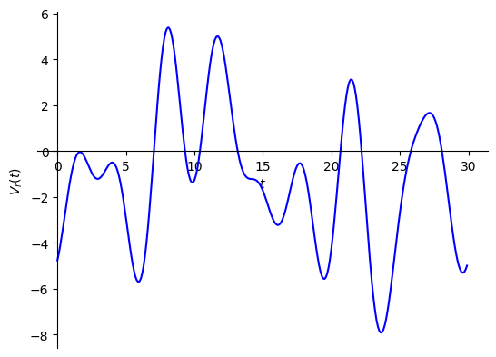
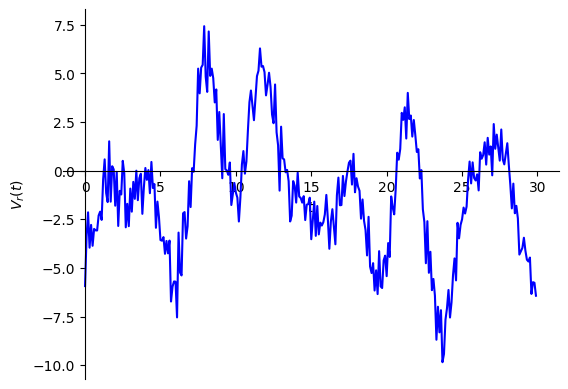
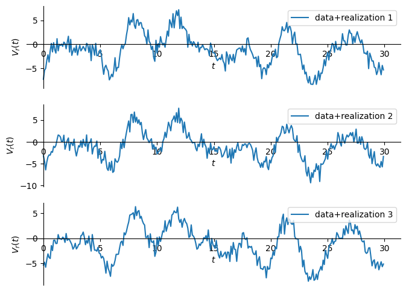

# מה זה רעש

לרוב העולם שאנחנו מדמיינים נראה ככה

מישהו משדר לי אות ואני קולט אותו באופן הבא:

כשבפועל סיגנל אף פעם לא נראה ככה אלא יותר ככה:

כלומר תמיד יהיה לנו בסיגנל שלנו "רעש". חלק לא צפוי שמפריע לנו (לרוב).

רעשים הם אינהרנטים לכל מערכת פיזיקלית. במערכות שיש בהם רכיבים חשמליים
תמיד נמצא לפחות שני רעשים:
* רעש טרמי - רעש שנוצר מהתנודות האקראיות של חלקיקים. תנועה של מטענים זה זרם. וזרם מתורגם למתח
* רעש שוט - דומה לרעש קוונטיזציה. נובע מכך שנושאי המטען שלנו (האלקטרונים) הם בדידים. ולכן הזרם הוא בעצם אות מקוונטט

כמובן שיש עוד אינסוף מקורות שאנחנו מתייחסים אליהם או שהם מתנהגים כמו רעש:
* מכסחות דשא
* מזגנים
* האוטובוסים ברחוב מחוץ לדירה שלי
* המון אנשים שמדברים בו זמנית
* מאווררים
* משדרים אחרים
* שבשים של תקשורת

לצורך הדיון שלנו ההבדל בין הפרעה לרעש הוא שנתייחס לרעש כאקראי. כלומר רעש
לא ניתן לצפות במדוייק בעוד הפרעה כן.

המודל שלנו יהיה כמעט תמיד שבשלב שבו רעש מתווסף הוא מתווסף לאות כאיבר נוסף כלומר:

$$\underset{\text{הטילקב}}{\underbrace{V_{r}\left(t\right)}}=\underset{\text{יקנ}-\text{תוא}}{\underbrace{V_{s}\left(t\right)}}+\underset{\text{שער}}{\underbrace{n\left(t\right)}}$$

חשוב לשים לב שלדוגמא אוזניות שמבטלות רעשים לא באמת מבטלות רעשים אלא הפרעות.
הן מודדות את ההפרעות מהסביבה כל הזמן.

מבחינתנו בשורה התחתונה:

> רעש אינו אות דטרמיניסטי עם נוסחה כמו $\sin\left(\omega_{0}t\right)$
> אלא הוא **אות אקראי** (כמו הטלת קוביה)

זה אומר שאם נחזור על אותו ניסוי שוב ושוב (נגיד הקלטה של אות) הרעש יהיה שונה כל פעם. הרעש בכל ניסוי נקרא **ריאליזציה**.
אוסף כל הניסויים נקרא **אנסמבל**, והוא מגדיר את הסטטסיטיקה של הרעש.

נניח אם היינו מקליטים 3 פעמים את אותו סיגנל היינו מקבלים 3 תוצאות שונות:

חשוב לציין שיש אותות אקראיים שאנחנו לא מתייחסים אליהם כרעש. לדוגמא:
* תנועה של יטושים במרחב
* דעיכה של אטומים רדיואקטיבים
* תנודות של מניות בבורסה
* ירי של ניורונים

באופן כללי הרבה מערכות קשה לנתח באופן מיקרוסקופי ונוכל לעבוד רק עם הסתברויות
ולהניח שיש סטטיסטיקה שאנחנו דוגמים ממנה.